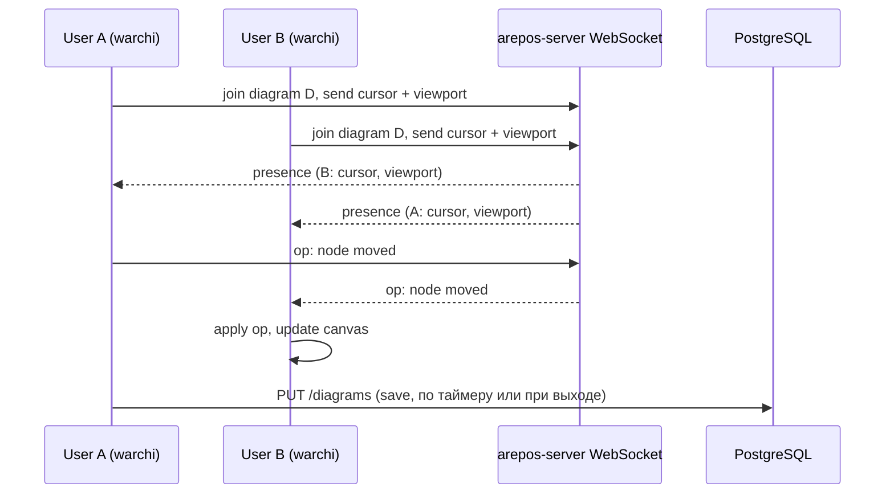

# Совместное редактирование диаграмм (курсоры и действия)

## Текущее состояние

- **warchi**: редактор диаграмм в [ModelDiagramCanvas.vue](src/features/models/components/ModelDiagramCanvas.vue) — Papirus `DiagramRenderer`, состояние диаграммы в `activeDiagram.parsedAttrs` (nodes/edges), сохранение через `emit('updateDiagram', next)` и REST API.
- **arepos-server**: только REST для диаграмм ([DiagramsController.kt](../../arepos-server/src/main/kotlin/ru/kavader/arepos/controller/DiagramsController.kt)); WebSocket не используется.
- **Papirus**: есть `addOverlayRenderer`, `screenToWorld`/`worldToScreen`, события `select`, `nodeAdd`, `drag`, `pan`, `zoom` — всего достаточно для отправки и отрисовки presence и операций.

## Целевая архитектура

- **Presence**: курсор в мировых координатах + опционально viewport (zoom, offset) и имя/цвет пользователя; рассылка по комнате диаграммы с троттлингом (например, 10–15 раз/с).
- **Операции**: события «узел сдвинут», «узел добавлен», «узел удалён», «связь создана/удалена/переподключена» и т.д.; сервер рассылает подписчикам комнаты; на клиенте применяем к локальному состоянию и к Papirus (без повторного emit в родителя до следующего сохранения).
- **Persistence**: без изменений — сохранение через существующий REST (по таймеру / при выходе). При конфликтах — last-write-wins или простая проверка версии/даты (можно уточнить позже).

## 1. Backend: WebSocket на arepos-server

- **Зависимость**: `spring-boot-starter-websocket` (Spring Boot 3.x поддерживает из коробки).
- **Протокол**: STOMP поверх SockJS для совместимости и подписок по темам (комната = диаграмма).
- **Маршруты** (идея):
  - `/app/diagram.presence` — клиент шлёт `{ diagramId, worldX, worldY, viewport? }`.
  - `/app/diagram.operation` — клиент шлёт операцию (тип + payload).
  - `/topic/diagram/{diagramId}` — подписка: presence и операции по данной диаграмме.
- **Авторизация**: те же JWT (или сессия), что и для REST; проверка доступа к диаграмме через существующий `ResourceAccessService.canViewDiagram`/`canEditDiagram` при join.
- **Модели сообщений** (Kotlin data class): например `PresenceMessage(userId, userName?, color?, worldX, worldY, viewport?)`, `DiagramOperation(type, payload, userId, timestamp)`.
- **Логика**: при подключении клиент подписывается на `topic/diagram/{id}`; сервер при получении presence/operation пересылает в эту тему (исключая отправителя при необходимости). Комнату хранить в памяти (Set по diagramId) или не хранить — просто broadcast в тему.

Ключевые файлы:

- Новый конфиг WebSocket: например `WebSocketConfig.kt` (регистрация STOMP endpoint, маппинг префиксов).
- Обработчик сообщений: например `DiagramCollaborationHandler.kt` — приём presence/operation, проверка прав, отправка в `/topic/diagram/{id}`.
- Интеграция с `ResourceAccessService` при join (по diagramId из сообщения или из destination подписки).

## 2. Frontend (warchi): подключение и отправка

- **Composable**: например `useDiagramCollaboration(diagramId, options)` в `src/composables/`:
  - При `diagramId` и наличии прав — установка WebSocket (SockJS + STOMP), подписка на `topic/diagram/{diagramId}`.
  - Отправка presence: по `mousemove` на canvas (или через Papirus InputHandler, если доступен) с троттлингом; координаты переводить в world через `renderer.screenToWorld(clientX, clientY)` перед отправкой; при необходимости отправлять и viewport (zoom, offsetX, offsetY) из renderer.
  - Отправка операций: при действиях, которые уже порождают `updateDiagram` или события (drag end, node add, edge add, delete и т.д.) — дополнительно слать сообщение в WebSocket с типом и минимальным payload (например, nodeId, x, y; или patch для instances).
- **Где вызывать**: в [ModelEditor.vue](src/features/models/ModelEditor.vue) или в месте, где рендерится `ModelDiagramCanvas` и известны `activeDiagram` и доступ к `canvasContextChange` (renderer). Передавать в canvas `renderer` и `diagramId` в composable, чтобы подписаться на mousemove контейнера и слать presence, а операции слать из обработчиков, которые уже вызывают `emit('updateDiagram', ...)`.

Детали:

- Подключение только при открытой одной диаграмме (activeDiagram.id).
- При размонтировании / смене диаграммы — отписка и отключение.
- Имя/цвет пользователя: из `useAuth` (currentUser) и зарезервированная палитра по userId для стабильного цвета курсора.

## 3. Отрисовка чужих курсоров и отображение действий

- **Курсоры**:
  - В warchi после получения `canvasContextChange` зарегистрировать overlay через `renderer.addOverlayRenderer(callback)`.
  - В callback рисовать по списку удалённых presence (из composable): для каждой записи — `worldToScreen(worldX, worldY)` и рисовать на canvas в экранных координатах (после текущего transform в Papirus overlay уже world — можно рисовать в world как есть). Проще: хранить в composable `remoteCursors` (world X,Y + user label), в overlay — цикл по ним и отрисовка (кружок/стрелка + текст имени).
  - Альтернатива: рисовать курсоры в отдельном DOM-слое поверх canvas (div с position:absolute и элементами по `worldToScreen`), чтобы не трогать Papirus — тоже допустимо и упрощает кастомизацию (иконки, тултипы).
- **Действия**:
  - При получении операции по WebSocket применять её к локальному состоянию диаграммы (тот же формат, что и `DiagramAttrs`): обновить `instances.nodes` / `instances.edges` и вызвать синхронизацию с Papirus (в ModelDiagramCanvas уже есть `syncDiagram()` — обновить узлы/рёбра по instances). Чтобы не было двойного сохранения, помечать источник операции как «remote» и не эмитить `updateDiagram` в родителя при применении remote op (только обновить локальный state и Papirus).

## 4. Согласование операций и форматы

- **Минимальный набор операций** (расширяемый):
  - `node_move` — `{ instanceId, x, y }` или `{ instanceId, deltaX, deltaY }`.
  - `nodes_move` — массив сдвигов (для group drag).
  - `node_add`, `node_remove`, `edge_add`, `edge_remove`, `edge_reconnect` — с payload по текущей схеме DiagramAttrs.
- Либо один тип `diagram_patch` с частичным патчем `{ instances: { nodes: [...], edges: [...] } }` (только изменённые поля), чтобы не плодить типов.
- На клиенте при применении remote op: мержить в текущий `parsedAttrs` и вызывать пересинхронизацию canvas (syncDiagram), без отправки обратно в WebSocket и без немедленного REST save.

## 5. Papirus (опционально)

- Изменения в Papirus не обязательны: overlay для курсоров можно реализовать целиком в warchi через `addOverlayRenderer` и данные из composable.
- Если позже захочется вынести «presence overlay» в библиотеку — можно добавить в Papirus опцию типа `PresenceOverlay` с передачей списка `{ id, label, worldX, worldY, color }` и отрисовкой в существующем overlay-слое.

## 6. Безопасность и границы

- Проверка прав при join: только пользователи с `canViewDiagram` (или `canEditDiagram` для отправки операций) могут подписаться на тему диаграммы.
- Не передавать по WebSocket полный JWT; идентификация по сессии/подключению, привязанной к пользователю после handshake (как обычно в Spring Security WebSocket).

## Порядок внедрения (рекомендуемый)

1. **arepos-server**: WebSocket config + STOMP, один endpoint и тема `/topic/diagram/{id}`; handler принимает presence и пересылает в тему; проверка прав по diagramId при первом сообщении или при подписке.
2. **warchi**: composable `useDiagramCollaboration`, подключение при открытии диаграммы, отправка presence (mousemove + screenToWorld), приём и сохранение в ref `remoteCursors`.
3. **warchi**: отрисовка удалённых курсоров (overlay на canvas или DOM-слой).
4. **warchi + arepos-server**: формат операций, отправка при drag/resize/add/delete, приём и применение на клиенте (обновление state + syncDiagram без emit updateDiagram).
5. При необходимости: доработка конфликтов при сохранении (версия/дата), индикация «сохраняется» и отключение при потере прав.

## Риски и упрощения

- **Конфликты**: при одновременном редактировании два клиента могут разойтись; первый вариант — last-write-wins по PUT; при необходимости позже добавить версию диаграммы или простой OT/CRDT по instances.
- **Масштаб**: если пользователей в одной диаграмме много, троттлинг presence и сжатие payload уменьшат нагрузку; при необходимости ограничить число подписчиков на одну диаграмму.
