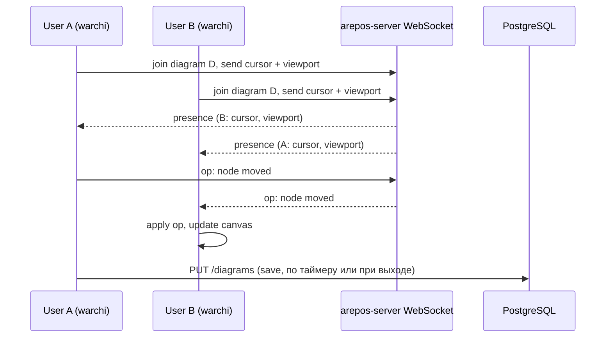

# Совместное редактирование диаграмм (курсоры и действия)

Этот документ — **план слоя real-time для одной диаграммы** (комната `diagram:{diagramId}`): presence, поток операций на canvas, debounce-сохранение в БД. Это **не дубликат** [plans/model-live-sync.md](plans/model-live-sync.md): там — шина **модели** (`model:{modelId}`: ноды, связи, `diagram_updated` после REST save, коалесценция по сущности). Оба канала сосуществуют: дерево и сущности подтягиваются по модели, жесты на холсте — по диаграмме.

**Фазы внедрения:**

| Фаза | Документ | Смысл |
|------|----------|--------|
| 1 | [plans/diagram-edit-locks.md](plans/diagram-edit-locks.md) | Эксклюзивная запись одной диаграммы (lock + view-only). |
| 2 | **этот файл** | Несколько редакторов на одном canvas: WebSocket/STOMP, ops, автосейв; lock ослабляется или заменяется soft-presence. |
| Параллельно / до | [plans/model-live-sync.md](plans/model-live-sync.md), [plans/model-batch-save-conflicts.md](plans/model-batch-save-conflicts.md) | Актуальность модели и мерж при save — отдельно от частоты курсоров. |

Детали **двухканальной** архитектуры (не смешивать presence с entity-событиями, seq/snapshot при реконнекте, перспектива CRDT) — в [plans/model-live-sync.md](plans/model-live-sync.md) (раздел «Эволюция архитектуры: к одновременному редактированию диаграммы»).

**См. также:** индекс эпиков — [plans/modeling-collaboration-index.md](plans/modeling-collaboration-index.md).

## Текущее состояние

- **warchi**: редактор диаграмм в [ModelDiagramCanvas.vue](src/features/models/components/ModelDiagramCanvas.vue) — Papirus `DiagramRenderer`, состояние диаграммы в `activeDiagram.parsedAttrs` (nodes/edges), сохранение через `emit('updateDiagram', next)` и REST API.
- **arepos-server**: только REST для диаграмм ([DiagramsController.kt](../../arepos-server/src/main/kotlin/ru/kavader/arepos/controller/DiagramsController.kt)); WebSocket не используется.
- **Papirus**: есть `addOverlayRenderer`, `screenToWorld`/`worldToScreen`, события `select`, `nodeAdd`, `drag`, `pan`, `zoom` — всего достаточно для отправки и отрисовки presence и операций.

## Целевая архитектура

- **Presence**: курсор в мировых координатах + опционально viewport (zoom, offset) и имя/цвет пользователя; рассылка по комнате диаграммы с троттлингом (например, 10–15 раз/с).
- **Операции**: события «узел сдвинут», «узел добавлен», «узел удалён», «связь создана/удалена/переподключена» и т.д.; сервер рассылает подписчикам комнаты; на клиенте применяем к локальному состоянию и к Papirus (без повторного emit в родителя до следующего сохранения).
- **Persistence**: при совместном редактировании — автосохранение с debounce (см. раздел 7). REST PUT без изменений; кнопка «Сохранить» даёт немедленное сохранение.

## 1. Backend: WebSocket на arepos-server

- **Зависимость**: `spring-boot-starter-websocket` (Spring Boot 3.x поддерживает из коробки).
- **Протокол**: STOMP поверх SockJS для совместимости и подписок по темам (комната = диаграмма).
- **Маршруты** (идея):
  - `/app/diagram.presence` — клиент шлёт `{ diagramId, worldX, worldY, viewport? }`.
  - `/app/diagram.operation` — клиент шлёт операцию (тип + payload).
  - `/topic/diagram/{diagramId}` — подписка: presence и операции по данной диаграмме.
- **Авторизация**: те же JWT (или сессия), что и для REST; проверка доступа к диаграмме через существующий `ResourceAccessService.canViewDiagram`/`canEditDiagram` при join.
- **Модели сообщений** (Kotlin data class): например `PresenceMessage(userId, userName?, color?, worldX, worldY, viewport?)`, `DiagramOperation(type, payload, userId, timestamp)`.
- **Логика**: при подключении клиент подписывается на `topic/diagram/{id}`; сервер при получении presence/operation пересылает в эту тему (исключая отправителя при необходимости). Комнату хранить в памяти (Set по diagramId) или не хранить — просто broadcast в тему.

Ключевые файлы:

- Новый конфиг WebSocket: например `WebSocketConfig.kt` (регистрация STOMP endpoint, маппинг префиксов).
- Обработчик сообщений: например `DiagramCollaborationHandler.kt` — приём presence/operation, проверка прав, отправка в `/topic/diagram/{id}`.
- Интеграция с `ResourceAccessService` при join (по diagramId из сообщения или из destination подписки).

## 2. Frontend (warchi): подключение и отправка

- **Composable**: например `useDiagramCollaboration(diagramId, options)` в `src/composables/`:
  - При `diagramId` и наличии прав — установка WebSocket (SockJS + STOMP), подписка на `topic/diagram/{diagramId}`.
  - Отправка presence: по `mousemove` на canvas (или через Papirus InputHandler, если доступен) с троттлингом; координаты переводить в world через `renderer.screenToWorld(clientX, clientY)` перед отправкой; при необходимости отправлять и viewport (zoom, offsetX, offsetY) из renderer.
  - Отправка операций: при действиях, которые уже порождают `updateDiagram` или события (drag end, node add, edge add, delete и т.д.) — дополнительно слать сообщение в WebSocket с типом и минимальным payload (например, nodeId, x, y; или patch для instances).
- **Где вызывать**: в [ModelEditor.vue](src/features/models/ModelEditor.vue) или в месте, где рендерится `ModelDiagramCanvas` и известны `activeDiagram` и доступ к `canvasContextChange` (renderer). Передавать в canvas `renderer` и `diagramId` в composable, чтобы подписаться на mousemove контейнера и слать presence, а операции слать из обработчиков, которые уже вызывают `emit('updateDiagram', ...)`.

Детали:

- Подключение только при открытой одной диаграмме (activeDiagram.id).
- При размонтировании / смене диаграммы — отписка и отключение.
- Имя/цвет пользователя: из `useAuth` (currentUser) и зарезервированная палитра по userId для стабильного цвета курсора.

## 3. Отрисовка чужих курсоров и отображение действий

- **Курсоры**:
  - В warchi после получения `canvasContextChange` зарегистрировать overlay через `renderer.addOverlayRenderer(callback)`.
  - В callback рисовать по списку удалённых presence (из composable): для каждой записи — `worldToScreen(worldX, worldY)` и рисовать на canvas в экранных координатах (после текущего transform в Papirus overlay уже world — можно рисовать в world как есть). Проще: хранить в composable `remoteCursors` (world X,Y + user label), в overlay — цикл по ним и отрисовка (кружок/стрелка + текст имени).
  - Альтернатива: рисовать курсоры в отдельном DOM-слое поверх canvas (div с position:absolute и элементами по `worldToScreen`), чтобы не трогать Papirus — тоже допустимо и упрощает кастомизацию (иконки, тултипы).
- **Действия**:
  - При получении операции по WebSocket применять её к локальному состоянию диаграммы (тот же формат, что и `DiagramAttrs`): обновить `instances.nodes` / `instances.edges` и вызвать синхронизацию с Papirus (в ModelDiagramCanvas уже есть `syncDiagram()` — обновить узлы/рёбра по instances). Чтобы не было двойного сохранения, помечать источник операции как «remote» и не эмитить `updateDiagram` в родителя при применении remote op (только обновить локальный state и Papirus).

## 4. Согласование операций и форматы

- **Минимальный набор операций** (расширяемый):
  - `node_move` — `{ instanceId, x, y }` или `{ instanceId, deltaX, deltaY }`.
  - `nodes_move` — массив сдвигов (для group drag).
  - `node_add`, `node_remove`, `edge_add`, `edge_remove`, `edge_reconnect` — с payload по текущей схеме DiagramAttrs.
- Либо один тип `diagram_patch` с частичным патчем `{ instances: { nodes: [...], edges: [...] } }` (только изменённые поля), чтобы не плодить типов.
- На клиенте при применении remote op: мержить в текущий `parsedAttrs` и вызывать пересинхронизацию canvas (syncDiagram), без отправки обратно в WebSocket и без немедленного REST save.

## 5. Papirus (опционально)

- Изменения в Papirus не обязательны: overlay для курсоров можно реализовать целиком в warchi через `addOverlayRenderer` и данные из composable.
- Если позже захочется вынести «presence overlay» в библиотеку — можно добавить в Papirus опцию типа `PresenceOverlay` с передачей списка `{ id, label, worldX, worldY, color }` и отрисовкой в существующем overlay-слое.

## 6. Безопасность и границы

- Проверка прав при join: только пользователи с `canViewDiagram` (или `canEditDiagram` для отправки операций) могут подписаться на тему диаграммы.
- Не передавать по WebSocket полный JWT; идентификация по сессии/подключению, привязанной к пользователю после handshake (как обычно в Spring Security WebSocket).

## 7. Сохранение и автосохранение

При совместном редактировании то, что другие видят в реальном времени, должно попадать в БД. Если оставить только сохранение по кнопке, при закрытии вкладки без Save изменения теряются, а у остальных они уже отображались — это неприемлемо. Поэтому при включённой коллаборации (или всегда для редактора диаграмм) вводится автосохранение.

### Автосохранение с debounce

- После любого изменения диаграммы (локальное действие или применение удалённой операции) диаграмма считается «грязной»; запускается таймер debounce (рекомендуемо **2–3 секунды**).
- Если за это время новых изменений нет — выполняется один PUT текущей диаграммы (тот же механизм, что и по кнопке «Сохранить» в `useModelEditor.saveChanges()`).
- Кнопка **«Сохранить»** сохраняет немедленно и сбрасывает таймер автосохранения.
- В результате: то, что видят другие в реальном времени, через несколько секунд оказывается в БД; при закрытии вкладки без кнопки теряется только последние 2–3 секунды, не успевшие уйти по таймеру.
- Опционально: сохранение при **beforeunload** (закрытие вкладки / уход со страницы), чтобы минимизировать потери при неожиданном закрытии.

### Конфликты при сохранении

- Два пользователя могут почти одновременно инициировать сохранение (кнопка или срабатывание debounce).
- Минимум: **last-write-wins** — последний PUT перезаписывает; реализация проста, но один клиент может перезаписать изменения другого.
- Предпочтительно: на бэкенде хранить **версию** диаграммы (`updatedAt` или счётчик). В PUT передаётся ожидаемая версия; сервер принимает обновление только при совпадении, иначе возвращает 409 Conflict. На клиенте при 409: перезагрузить диаграмму с сервера и при необходимости предложить «есть конфликт, перезагрузить?» или повторить сохранение после мержа.
- В первой версии допустимо ограничиться last-write-wins; проверку версии можно добавить в шаге 5 порядка внедрения.

### Индикатор состояния сохранения

- Показывать пользователю одно из состояний: **«Сохранено»** / **«Сохранение…»** / **«Не сохранено»** (опционально — время последнего сохранения, например «Сохранено в 14:32»).
- При автосохранении не показывать модальные окна; при ошибке (сеть, 409) — уведомление (тост или inline) с возможностью повтора или «Сохранить вручную».

### Сводка изменения поведения

| Сейчас | При совместном редактировании |
|--------|-------------------------------|
| Сохранение только по кнопке «Сохранить» | Сохранение по кнопке + автосохранение (debounce 2–3 с после последнего изменения) |
| Закрыл вкладку без Save — все изменения теряются | Закрыл вкладку — теряется только последние 2–3 с (плюс при необходимости save в beforeunload) |
| Один пользователь | Несколько пользователей; то, что все видят в реальном времени, периодически попадает в БД |

## 8. Удаление узла модели, используемого на диаграмме

При совместном редактировании один пользователь может удалить **узёл модели** (из дерева модели), который у другого отображается на диаграмме как экземпляр. В данных диаграммы остаётся ссылка `modelNodeId` на уже несуществующий узел — получаются «висячие» экземпляры.

### Текущее поведение

- В дереве есть понятие «узел используется на диаграмме» (`usedNodeIds` в ModelTreePalettePanel), но оно используется только для стиля (подсветка неиспользуемых). Удалить узел модели, даже если он есть на диаграмме, можно: при подтверждении вызывается `markNodeDeleted(nodeId)`, узел уходит в «удалённые» и при сохранении исчезает из модели.
- В `attrs` диаграммы по-прежнему лежат экземпляры с этим `modelNodeId`. При отрисовке делается `nodeById.value.get(entity.modelNodeId)` — для удалённого узла вернётся `undefined`, возможны «битые» блоки или ошибки, если код не учитывает отсутствие узла.
- Бэкенд при удалении узла (DELETE node) не проверяет использование в диаграммах; валидации «не удалять, если узел на диаграмме» нет.

### Варианты при коллаборации

1. **Запрет удаления**  
   Не разрешать удалять узел модели, если он используется хотя бы в одной диаграмме (по текущим данным на клиенте или по проверке на бэкенде по `attrs` диаграмм модели). При попытке удаления — сообщение «Узел используется на диаграмме» и отмена. Плюс: нет висячих ссылок. Минус: пользователь должен сначала убрать узел со всех диаграмм.

2. **Событие «узел модели удалён» + очистка на клиентах**  
   При удалении узла модели (REST DELETE или подтверждение в UI) рассылать по каналу коллаборации (по модели или по затронутым диаграммам) событие вида `model_node_deleted { nodeId }`. Каждый клиент с открытой диаграммой этой модели: удаляет из `instances.nodes` все экземпляры с этим `modelNodeId`, удаляет из `instances.edges` рёбра, у которых source/target ссылаются на эти экземпляры, вызывает `syncDiagram()`. В результате диаграмма сразу «очищается» от удалённого узла у всех. Сохранение (в т.ч. автосохранение) потом унесёт обновлённый attrs в БД.

3. **Обработка «сирот» без рассылки**  
   Разрешить удаление; при загрузке модели и отрисовке диаграммы считать экземпляр «сиротой», если `nodeById.get(instance.modelNodeId)` отсутствует. Показывать плейсхолдер («Удалённый узел») или не рисовать такой экземпляр; при сохранении диаграммы опционально удалять сирот из `instances`. Минус при коллаборации: второй пользователь может долго видеть «призрак» узла, пока не обновит модель или не перезагрузит страницу.

### Рекомендация

Для совместного редактирования предпочтительно комбинировать **(1)** и **(2)**:

- **Бэкенд (опционально)**: при DELETE узла проверять, не фигурирует ли его id в `attrs` диаграмм этой модели; при наличии — 409 с текстом «Узел используется на диаграмме». Так сохраняется консистентность даже при расхождении клиентов.
- **Фронт при коллаборации**: при успешном удалении узла модели отправлять в канал коллаборации по модели (или по диаграмме) событие `model_node_deleted` с `nodeId`; все клиенты с открытой этой моделью/диаграммой удаляют соответствующие экземпляры и рёбра из текущего состояния диаграммы и вызывают `syncDiagram()`. Автосохранение затем сохранит обновлённую диаграмму.

Дополнительно можно оставить **устойчивость к сиротам** на отрисовке: если узел модели не найден, не падать, а рисовать плейсхолдер или пропускать экземпляр — на случай старых данных или отложенной доставки события.

### Старые версии диаграмм и история

У диаграммы есть семантическое версионирование (model + name + version → отдельная запись в БД). **Старые версии** (другие версии той же диаграммы или другие диаграммы) — это отдельные строки со своими `attrs`; их мы **не трогаем**.

- **Очистка только в текущей редакции**: событие `model_node_deleted` и удаление экземпляров применяются только к **текущей открытой в редакторе** диаграмме (та, что сейчас редактируется). Сохраняем мы только эту запись (PUT по её id). Остальные записи диаграмм (прошлые версии «Main» 1.0.0, 1.1.0, другие диаграммы) **никогда не перезаписываем** из этого сценария — в них компонент/экземпляр **остаётся для истории**.
- **Просмотр старых версий**: при открытии старой версии диаграммы в `attrs` могут быть экземпляры с `modelNodeId`, которого уже нет в модели (узел удалили позже). Такие экземпляры не удаляем из данных — они часть истории. При **отрисовке** такой версии узел модели не находится (`nodeById.get(instance.modelNodeId)` — undefined), поэтому нужна **устойчивость к сиротам**: рисовать плейсхолдер (например, «Удалённый узел» / «[Removed]») вместо падения или пустого блока. Тогда и история сохраняется, и просмотр старых версий остаётся рабочим.

Итого: в старых версиях диаграммы компонент остаётся в `attrs`, данные не меняются; в текущей редактируемой версии экземпляры удалённого узла убираем по событию; при отображении любых версий отсутствующий узел показываем как плейсхолдер.

## Порядок внедрения (рекомендуемый)

1. **arepos-server**: WebSocket config + STOMP, один endpoint и тема `/topic/diagram/{id}`; handler принимает presence и пересылает в тему; проверка прав по diagramId при первом сообщении или при подписке.
2. **warchi**: composable `useDiagramCollaboration`, подключение при открытии диаграммы, отправка presence (mousemove + screenToWorld), приём и сохранение в ref `remoteCursors`.
3. **warchi**: отрисовка удалённых курсоров (overlay на canvas или DOM-слой).
4. **warchi + arepos-server**: формат операций, отправка при drag/resize/add/delete, приём и применение на клиенте (обновление state + syncDiagram без emit updateDiagram).
5. **warchi**: автосохранение с debounce (2–3 с) при изменении диаграммы (локально или от remote op), индикатор «Сохранено» / «Сохранение…» / «Не сохранено»; опционально — сохранение в beforeunload.
6. **Удаление узла с диаграммы** (раздел 8): при удалении узла модели рассылать `model_node_deleted`; на клиентах убирать соответствующие экземпляры и рёбра из диаграммы и вызывать syncDiagram. Опционально: проверка на бэкенде при DELETE узла (409, если узел используется в attrs диаграмм); устойчивость отрисовки к «сиротам» (плейсхолдер или пропуск).
7. При необходимости: проверка версии при PUT (409 при конфликте), обработка на клиенте; отключение при потере прав.

## Риски и упрощения

- **Конфликты**: при одновременном редактировании два клиента могут разойтись; первый вариант — last-write-wins по PUT; при необходимости позже добавить версию диаграммы или простой OT/CRDT по instances.
- **Масштаб**: если пользователей в одной диаграмме много, троттлинг presence и сжатие payload уменьшат нагрузку; при необходимости ограничить число подписчиков на одну диаграмму.
