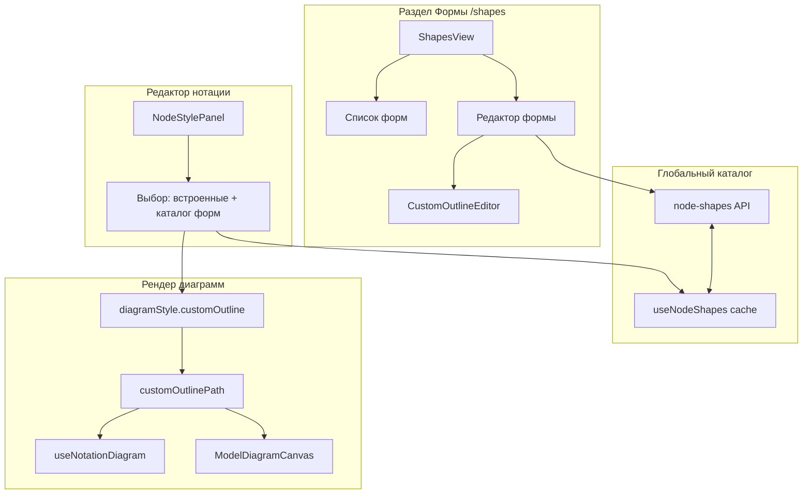

# План: отдельный редактор форм и выбор формы в редакторе нотации

## Цель

Сейчас форма узла выбирается только из встроенного списка (rectangle, diamond, circle, beveled-rectangle, trapezoid, slanted-rectangle). Нужно:

1. **Редактор форм — отдельный раздел приложения** (как редактор типов `/types`): свой маршрут, свой экран со списком форм и редактированием одной формы. Пользователь создаёт и редактирует кастомные формы (прямоугольник + точки перелома, участки Bezier); формы сохраняются на бэкенде.
2. **Созданные формы доступны всем**: кастомные формы — глобальный каталог (не привязаны к конкретной нотации); любой пользователь может выбрать любую форму при настройке компонента в редакторе нотации или при отрисовке диаграммы модели.
3. **В редакторе нотации** (и в модельном редакторе) при настройке компонента форма выбирается из списка: встроенные формы + все кастомные формы из каталога.

При выборе кастомной формы в компонент **копируется контур** (`customOutline` в diagramStyle); опционально сохраняется ссылка на форму в каталоге (`customShapeId`). Так уже созданные компоненты и диаграммы не зависят от удаления или изменения формы в каталоге.

## Модель данных

### Контур формы (OutlineSegment)

Замкнутый контур в **нормализованных координатах** (0 ≤ x,y ≤ 1), масштабируется по ширине/высоте узла.

```ts
type OutlineSegment =
  | { type: 'line'; points: [[number, number], [number, number]] }
  | { type: 'bezier'; points: [[number, number], [number, number], [number, number], [number, number]] }

const DEFAULT_RECTANGLE_OUTLINE: OutlineSegment[] = [
  { type: 'line', points: [[0, 0], [1, 0]] },
  { type: 'line', points: [[1, 0], [1, 1]] },
  { type: 'line', points: [[1, 1], [0, 1]] },
  { type: 'line', points: [[0, 1], [0, 0]] }
]
```

### Кастомная форма (в глобальном каталоге)

```ts
interface CustomShapeDef {
  id: string
  name: string
  outline: OutlineSegment[]
  ownerId?: string  // кто создал; на бэкенде есть owner
}
```

### Где хранятся формы

Формы хранятся **на бэкенде** (arepos-server) как **глобальный каталог**: сущность node shape **без привязки к нотации**, с полем owner (кто создал). **Доступ по аналогии с типами (NodeTypes/LinkTypes), с отличием:** видеть могут **все** (любой авторизованный пользователь видит все формы в списке и может выбирать любую для компонента); **редактировать** (изменять контур, удалять) может только владелец или пользователь, которому выдан доступ через механизм шаринга (ResourceShares), как у типов. Подробности — в разделе «Поддержка в бэкенде» ниже.

### Копирование контура в компонент при выборе формы

Чтобы удаление или изменение формы в каталоге не ломало уже созданные компоненты и диаграммы, при выборе кастомной формы **копируем контур в компонент** (в его diagramStyle), а не только ссылку.

В `DiagramStyle` (в attrs компонента):

- `nodeShape: string` — для встроенных форм значения `'rectangle' | 'diamond' | ...`; для кастомной — `'custom'`.
- **`customOutline?: OutlineSegment[]`** — **копия** контура на момент выбора формы. Используется при рендере; хранится в attrs компонента (вместе с остальным diagramStyle). Так компонент и диаграмма не зависят от того, удалили или изменили форму в каталоге.
- **`customShapeId?: string`** — опционально: id формы в каталоге (для отображения в UI «на основе формы X» и для возможной кнопки «Обновить форму из каталога» в будущем).

**Логика при выборе формы:** пользователь выбирает форму из каталога → в diagramStyle записываем `nodeShape = 'custom'`, **копируем** `shape.outline` в `customOutline`, при желании сохраняем `customShapeId = shape.id`.

**При рендере:** если `nodeShape === 'custom'` и задан **customOutline**, контур берётся из него (path/svgPath строятся из `customOutline`). Каталог для отрисовки не нужен. **Fallback:** если customOutline отсутствует или пустой (старые данные, миграция) — рисовать **прямоугольник**; каталог в рендер не подтягивать.

## Поддержка в бэкенде (arepos-server)

Добавить сущность **кастомная форма узла** (node shape) и REST API по образцу **NodeTypes** (глобальный каталог, owner для прав записи, список доступен всем).

### Модель и БД

- **Сущность** (например `NodeShapes.kt` в `model/`):
  - `id: UUID` (PK)
  - `name: String`
  - `owner: Users` (ManyToOne, FK) — кто создал форму
  - `outline: String?` (JSONB, JSON-массив сегментов контура — формат `OutlineSegment[]`)
  - `createdAt`, `updatedAt`
  **Без связи с нотацией** — формы общие для всех. Без версионирования.

- **Миграция Liquibase** (например `015-add-node-shapes.sql`):
  - Таблица `node_shapes`: колонки `id` (uuid), `name`, `owner` (uuid, FK → users), `outline` (jsonb), `created_at`, `updated_at`.
  - Индекс по `owner` для фильтра «мои формы». Уникальность имени в рамках одного владельца (owner, name) — по желанию.
  - Аудит по аналогии с другими таблицами.

### Репозиторий и контроллер

- **Repository** (например `NodeShapesRepository.kt`): `JpaRepository<NodeShapes, UUID>`, методы `findByOwner(owner, pageable)`, `findAll(pageable)`.
- **Controller** (например `NodeShapesController.kt`), путь `/api/v1/node-shapes` (по аналогии с [NodeTypesController](arepos-server/src/main/kotlin/ru/kavader/arepos/controller/NodeTypesController.kt)):
  - `GET /api/v1/node-shapes` — список всех форм (пагинация, опционально фильтр по ownerId, name). **Чтение — всем** авторизованным.
  - `GET /api/v1/node-shapes/{id}` — одна форма по id. Чтение — всем. В ответе отдавать флаг **canEdit: boolean** (владелец или доступ через шаринг), чтобы фронт показывал/скрывал кнопки редактирования и удаления.
  - `POST /api/v1/node-shapes` — создание (body: name, outline); owner = текущий пользователь. Любой авторизованный.
  - `PUT /api/v1/node-shapes/{id}` — обновление (name, outline). **Только при праве на редактирование:** владелец или пользователь с доступом через шаринг — вызов `accessService.requireCanEditNodeShape(shape)` перед сохранением.
  - `DELETE /api/v1/node-shapes/{id}` — удаление. Только при праве на редактирование (так же `requireCanEditNodeShape`).
- **Права доступа (как у типов):** в [ResourceAccessService](arepos-server/src/main/kotlin/ru/kavader/arepos/security/ResourceAccessService.kt) добавить `canEditNodeShape(shape)`, `requireCanEditNodeShape(shape)`. Использовать `canEditTopLevel(ownerId, ShareResourceType.NODE_SHAPE, shapeId)`. В [ShareResourceType](arepos-server/src/main/kotlin/ru/kavader/arepos/model/ResourceShares.kt) добавить **NODE_SHAPE**. В [AccessSharesController](arepos-server/src/main/kotlin/ru/kavader/arepos/controller/AccessSharesController.kt) добавить поддержку шаринга для NODE_SHAPE (владелец может выдавать право редактирования формы).

### DTO и ответы

- Request: `NodeShapeRequest(name: String, outline: String?)` (без notationId).
- Response: `NodeShapeResponse(id, name, ownerId, outline, createdAt?, updatedAt?, canEdit: Boolean)` — фронт получает id, name, outline, ownerId; **canEdit** вычисляется на бэкенде (владелец или доступ через шаринг) для отображения кнопок редактирования/удаления. Поле **canEdit** должно быть в ответе и **GET /:id**, и **GET list** (в каждом элементе списка), чтобы UI мог показывать кнопки без дополнительных запросов и с учётом шаринга.

## Архитектура по слоям (фронтенд)

### 1. Типы и загрузка каталога форм

- **notationAttrs.ts**: типы `OutlineSegment`, `CustomShapeDef`. В `DiagramStyle` добавить `customOutline?: OutlineSegment[]` (копия контура в компоненте) и `customShapeId?: string` (опциональная ссылка на форму в каталоге). В `normalizeDiagramStyle` при разборе attrs проверять и нормализовать `customOutline` (массив сегментов).
- **API (warchi)**: типы `NodeShapeResponse`, `NodeShapeRequest` в `types/api.ts` (без notationId); вызовы к `/api/v1/node-shapes` (GET список всех, GET /:id, POST, PUT, DELETE).
- **Каталог форм**: нужен для **выбора формы** в панели стиля (NodeStylePanel) и для опциональной кнопки «Обновить форму из каталога». Для **рендера** каталог не используется — контур берётся из копии в компоненте (customOutline). Composable `useNodeShapes()` или разовая загрузка списка при открытии панели стиля.

### 2. Построение Path2D и SVG из контура

- **Новый модуль** `src/utils/customOutlinePath.ts`:
  - `customOutlineToPath2D(segments: OutlineSegment[], width: number, height: number): Path2D`
  - `customOutlineToSvgPath(segments: OutlineSegment[], width: number, height: number): string`
  Масштабирование: (x, y) → (x * width, y * height). Обход сегментов: moveTo первого пункта, затем lineTo/bezierCurveTo, в конце closePath.

### 3. Редактор форм — отдельный раздел приложения (как редактор типов)

- **Маршрут и экран**: отдельный маршрут `/shapes` (аналогично `/types`), view [ShapesView.vue](warchi/src/views/ShapesView.vue) (по образцу [TypesView.vue](warchi/src/views/TypesView.vue)): шапка (AppHeader), основная часть с контентом, подвал (AppFooter). В основной части — страница редактора форм (аналог [TypeEditorPage.vue](warchi/src/features/types/TypeEditorPage.vue)): сайдбар со списком всех форм (загрузка через GET /api/v1/node-shapes), кнопка «Добавить форму», при выборе формы — форма редактирования (название + редактор контура). Сохранение и удаление через API (POST/PUT/DELETE) сразу, без привязки к сохранению нотации.
- **Навигация**: пункт «Формы» в главном меню (рядом с «Типы», «Нотации» и т.д.), переход по клику на `/shapes`.
- **Список форм**: сайдбар — список форм (название, опционально превью); фильтр «все» / «мои» по ownerId при желании. Кнопки: создать (всем), **редактировать** и **удалить** — показывать только для форм, по которым у текущего пользователя есть право редактирования (по полю **canEdit** из ответа API или по ownerId + шаринг). При выборе формы без права редактирования — показывать только просмотр (превью контура без кнопок сохранения/удаления) или заглушку «Нет прав на редактирование».
- **Редактор одной формы**: правая часть — поле «Название», компонент редактора контура. Кнопки «Сохранить», «Удалить» активны только если по форме есть canEdit; иначе форма только для просмотра.

### 4. Выбор формы в редакторе нотации (и в модельном редакторе)

- **NodeStylePanel.vue**: в блоке выбора формы — объединённый список (встроенные + кастомные из каталога). **При выборе кастомной формы из каталога:** записывать `nodeShape = 'custom'`, **копировать** `shape.outline` в `diagramStyle.customOutline`, при желании `customShapeId = shape.id`. При выборе встроенной формы: `customShapeId` и `customOutline` удалить.
  При загрузке стиля узла: для кастомной формы показывать выбранную запись по наличию `customOutline` или `customShapeId` (если есть customShapeId, в списке можно подсветить «на основе формы X» по каталогу).
- **Тип ComponentShape**: расширить на `'custom'` (форма определяется по сохранённому контуру `customOutline`).

### 5. Рендер и экспорт

- **useNotationDiagram.ts** и **ModelDiagramCanvas.vue**: при создании узла по форме компонента:
  - если `nodeShape === 'custom'` и в diagramStyle есть **customOutline**, контур берётся **из него** (без обращения к каталогу): `customOutlineToPath2D(ds.customOutline, w, h)` и `customOutlineToSvgPath(ds.customOutline, w, h)`. Так удаление или изменение формы в каталоге не влияет на уже созданные компоненты и диаграммы.
  - если `nodeShape === 'custom'` но customOutline нет (старые данные): опционально разрешить по customShapeId из каталога; иначе fallback на прямоугольник.
  Каталог форм при рендере не обязателен — он нужен только для выбора формы в панели стиля и для опциональной кнопки «Обновить из каталога».

### 6. Редактор контура (используется внутри редактора форм)

Один компонент (например `CustomOutlineEditor.vue`): приём/возврат `OutlineSegment[]` (modelValue / update:modelValue). Холст в нормализованных координатах; фаза 1 — полигон (вставка/перемещение/удаление точек на прямоугольнике); фаза 2 — переключение сегмента в Bezier и редактирование контрольных точек. Используется только в экране редактирования одной формы, не в NodeStylePanel.

## Use case: владелец формы удалил или изменил её (при копировании контура в компонент)

**Сценарий:** Пользователь 1 создал кастомную форму. Пользователь 2 создал нотацию, добавил компонент и выбрал эту форму — в компонент при выборе **скопировался контур** (customOutline в diagramStyle). Затем пользователь 1 удаляет или изменяет форму в каталоге.

**При хранении копии контура в компоненте:**

- **Форма удалена:** Рендер берёт контур из `diagramStyle.customOutline`; каталог не используется. Узел на диаграмме модели (и в редакторе нотации) продолжает отображаться **как раньше** — с тем контуром, который был скопирован при выборе. Удаление формы в каталоге на уже созданные компоненты **не влияет**.
- **Форма изменена:** Аналогично: у компонента своя копия контура (customOutline), рендер не обращается к каталогу. Диаграмма **не меняется** — User 2 по-прежнему видит ту форму, которую выбирал. Если в будущем добавить кнопку «Обновить форму из каталога» (по customShapeId), пользователь сможет сознательно подставить актуальный контур из каталога.

**Итог:** Копирование контура в компонент при выборе формы **развязывает** проблему удаления и модификации: диаграммы и компоненты стабильны, каталог влияет только на момент выбора (и опционально на действие «обновить из каталога»).

## Порядок реализации

1. **Бэкенд (arepos-server)**: сущность NodeShapes (owner, name, outline); миграция 015; репозиторий; контроллер (GET list и GET /:id — всем авторизованным, в ответе при необходимости canEdit; POST — всем, PUT/DELETE — только при праве редактирования). Добавить ShareResourceType.NODE_SHAPE, в ResourceAccessService — canEditNodeShape / requireCanEditNodeShape; поддержка шаринга форм в AccessSharesController (чтобы владелец мог выдавать доступ на редактирование).
2. **Фронт — типы и API**: типы `OutlineSegment`, `CustomShapeDef`; в `DiagramStyle` — `customShapeId`; типы и вызовы API для node-shapes (без notationId). Composable `useNodeShapes()` (или аналог) для загрузки и кэширования списка всех форм.
3. Модуль `customOutlinePath.ts` (Path2D + svgPath по сегментам).
4. **Отдельный раздел «Редактор форм»**: маршрут `/shapes`, ShapesView, страница по образцу TypeEditorPage (сайдбар со списком форм из API, форма редактирования выбранной формы, CRUD сразу через API). Пункт «Формы» в главном меню.
5. UI выбора формы в NodeStylePanel: объединённый список (встроенные + формы из useNodeShapes / каталога), запись nodeShape и customShapeId.
6. Интеграция рендера: useNotationDiagram и ModelDiagramCanvas — ветка `nodeShape === 'custom'` + разрешение контура по customShapeId из загруженного каталога форм.
7. Компонент CustomOutlineEditor: полигон (точки перелома), затем при необходимости Bezier.

## Уточнения и варианты реализации

- **Формат outline в API:** В Request/Response поле `outline` — JSON-массив сегментов (как в TypeScript: `OutlineSegment[]`). На бэкенде в БД хранится как JSONB (тот же формат). В Kotlin DTO можно принимать/отдавать список структур (line: points; bezier: points) или `JsonNode`; при сохранении в entity — сериализация в строку JSON для JSONB.

- **Аудит:** В миграции 015 добавить триггер по образцу других таблиц: `CREATE TRIGGER node_shapes_audit_trigger AFTER INSERT OR UPDATE OR DELETE ON public.node_shapes FOR EACH ROW EXECUTE FUNCTION audit_trigger();`

- **AccessSharesController:** Для шаринга форм в `resolveOwnerId` добавить ветку `ShareResourceType.NODE_SHAPE` → загрузка формы через `NodeShapesRepository`, возврат `shape.owner.id`; внедрить `NodeShapesRepository` в контроллер.

- **ResourceAccessService:** Добавить `nodeShapeAccessPermission(shape: NodeShapes): String?` (по аналогии с `nodeTypeAccessPermission`) для UI управления доступом; плюс `canEditNodeShape(shape)`, `requireCanEditNodeShape(shape)`.

- **Уникальность имени формы:** В плане указано «по желанию». Варианты: (1) без уникальности — проще; (2) уникальная пара (owner, name) — в миграции UNIQUE(owner, name), при POST/PUT при дубликате возвращать 409. Решение оставить на реализацию; при выборе (2) добавить в миграцию и обработку в контроллере.

- **i18n:** Все строки раздела «Формы» (пункт меню, заголовки, кнопки «Создать», «Сохранить», «Удалить», «Нет прав на редактирование», сообщения об ошибках) вынести в `src/i18n/messages.ts` (ru/en).

- **OpenAPI:** При добавлении API node-shapes обновить `openapi.yaml` в arepos-server (описание эндпоинтов и схем NodeShapeRequest/NodeShapeResponse).

- **CustomOutlineEditor (фаза 1 — полигон):** На этапе реализации определить: добавление точки (двойной клик по ребру? контекстное меню?), перемещение точки (drag), удаление точки (контекстное меню или кнопка), минимальное число точек (например не меньше 3). Можно начать с простого варианта: клик по ребру добавляет точку, перетаскивание перемещает, правый клик — удалить.

## Чек-лист реализации (TODO)

- [ ] **Backend: права** — ShareResourceType.NODE_SHAPE в ResourceShares.kt; в ResourceAccessService — canEditNodeShape, requireCanEditNodeShape; поддержка NODE_SHAPE в AccessSharesController (шаринг форм).
- [ ] **Backend: сущность** — NodeShapes.kt, миграция 015 (таблица node_shapes, триггер аудита node_shapes_audit_trigger), NodeShapesRepository.
- [ ] **Backend: API** — NodeShapesController (GET list/id с canEdit, POST, PUT/DELETE с requireCanEditNodeShape), DTO NodeShapeRequest / NodeShapeResponse.
- [ ] **Frontend: типы и API** — в notationAttrs: OutlineSegment, DiagramStyle.customOutline/customShapeId, normalizeDiagramStyle; в types/api — NodeShapeResponse, NodeShapeRequest и вызовы к node-shapes; composable useNodeShapes().
- [ ] **Frontend: customOutlinePath** — модуль `src/utils/customOutlinePath.ts` (Path2D и svgPath по сегментам контура).
- [ ] **Frontend: раздел «Формы»** — маршрут `/shapes`, ShapesView, страница редактора форм (список в сайдбаре + форма редактирования), пункт «Формы» в главном меню, отображение кнопок по canEdit; i18n для раздела (ru/en).
- [ ] **Frontend: NodeStylePanel** — выбор формы (встроенные + каталог из useNodeShapes), при выборе кастомной: nodeShape = 'custom', копия outline в customOutline, customShapeId.
- [ ] **Frontend: рендер** — в useNotationDiagram и ModelDiagramCanvas ветка nodeShape === 'custom': контур из customOutline через customOutlinePath; fallback при отсутствии customOutline.
- [ ] **Frontend: CustomOutlineEditor** — компонент редактора контура (полигон; опционально Bezier), используется на странице редактирования формы.

## Схема потока данных



Итог: формы хранятся на бэкенде как **глобальный каталог**, **доступны всем** на чтение; создаются и правятся в **отдельном разделе** «Формы» (`/shapes`). При выборе формы для компонента в компонент **копируется контур** (customOutline); удаление или изменение формы в каталоге не влияет на уже созданные компоненты и диаграммы. Отрисовка и экспорт используют контур из копии в компоненте (customOutline).
