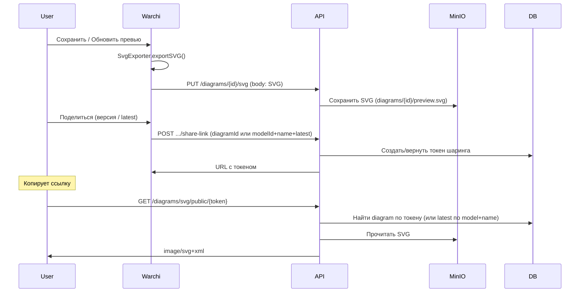

# Шаринг диаграммы как автообновляемая SVG-картинка по ссылке на сервер

План: сделать шаринг диаграммы как картинки по ссылке на сервер — клиент загружает сгенерированный SVG на сервер, сервер хранит и отдаёт по URL; при создании ссылки можно выбрать конкретную версию или «всегда последняя».

## Текущее состояние

- **Экспорт SVG** выполняется только на клиенте: в [ModelEditor.vue](src/features/models/ModelEditor.vue) используется `SvgExporter` из Papirus — он строит SVG из текущего состояния рендерера (ноды, рёбра, стили). Сервер не имеет логики отрисовки диаграммы.
- **Диаграммы на сервере** (arepos-server: `Diagrams.kt`, `DiagramsController.kt`): сущность с `id`, `model`, `name`, `version`, `notation`, `attrs` (JSON). Одна и та же диаграмма по имени может иметь несколько версий (разные `id`). Уже есть `findByModel_IdAndNameAndDeletedFalse` и сравнение версий в контроллере (baseline, `compareDiagramVersions`).
- **Доступ**: проверка `requireCanViewDiagram` / `canViewDiagram` в ResourceAccessService — для отдачи SVG достаточно того же права просмотра диаграммы.

## Подход

Сервер **не генерирует** SVG (для этого пришлось бы портировать Papirus или поднимать headless-браузер). Вместо этого:

1. **Клиент** по-прежнему генерирует SVG (SvgExporter) и **загружает** его на сервер (при сохранении диаграммы и/или по кнопке «Обновить превью»).
2. **Сервер** хранит SVG по диаграмме и отдаёт по HTTP как `image/svg+xml`.
3. **Ссылка** ведёт на сервер: либо на конкретную версию (по `diagramId`), либо на «всегда последнюю» (по `modelId` + имя диаграммы, сервер резолвит последнюю версию и отдаёт её SVG).

Таким образом «автообновляемость» для варианта «всегда последняя» обеспечивается тем, что при каждом сохранении/обновлении превью клиент заливает новый SVG для текущей (последней) версии, и одна и та же ссылка «latest» всегда отдаёт актуальный снимок.

## Архитектура

## 1. Бэкенд (arepos-server)

### 1.1 Хранение и выдача SVG

- **Храним в MinIO**: SVG сохраняется в MinIO (доступен только из бэкенда), путь вида `diagrams/{diagramId}/preview.svg`. Используется существующий FileStorageService (уже есть поддержка `image/svg+xml`). Прямых ссылок на MinIO наружу не выдаём.
- **Отдаём через API**: клиент и внешние системы (Notion, Confluence, ``) обращаются только к эндпоинтам бэкенда (GET `/api/v1/diagrams/{id}/svg` и т.д.). Бэкенд читает файл из MinIO и возвращает его в теле ответа с `Content-Type: image/svg+xml`.

Отдельная таблица в БД для SVG не нужна; при необходимости можно хранить в БД только факт наличия превью или `updated_at`, но минимальный вариант — только MinIO.

### 1.2 Публичный шаринг по токену

Доступ к картинке по ссылке даётся **только по токену**. Токен хранится в БД, ссылка имеет вид `.../svg/public/{token}`. Так можно отозвать доступ (удалить токен), выдать несколько ссылок, при необходимости добавить срок действия.

**Сущность «ссылка на превью»** (таблица, например `diagram_preview_links` или `diagram_share_tokens`):

- `token` (UUID или случайная строка, уникальный, не угадываемый) — в URL.
- Привязка к диаграмме: либо **конкретная версия** — `diagram_id` (UUID, FK → diagrams.id), либо **всегда последняя** — `model_id` + `diagram_name` (при запросе по токену резолвим latest по model+name).
- Опционально: `created_at`, `expires_at`, `created_by` (владелец диаграммы или создатель ссылки).

Миграция Liquibase: новая таблица, уникальный индекс по `token`.

### 1.3 Эндпоинты

- **PUT `/api/v1/diagrams/{id}/svg`** (только для загрузки превью)
  - Тело: raw SVG (text/xml или application/xml) или multipart file.
  - Права: `requireCanEditDiagram`.
  - Логика: сохранить/обновить файл в MinIO (`diagrams/{id}/preview.svg`), вернуть 204 или 200.

- **POST `/api/v1/diagrams/share-link`** (создать или получить ссылку с токеном)
  - Тело: `{ "diagramId": "uuid" }` для конкретной версии или `{ "modelId": "uuid", "diagramName": "Main", "latest": true }` для «всегда последняя».
  - Права: пользователь должен иметь право просмотра диаграммы (или редактирования).
  - Логика: если уже есть активная ссылка с такими параметрами — вернуть её URL (один токен на вариант «конкретная версия» или «latest по model+name» на усмотрение; можно и несколько токенов на одну диаграмму). Иначе создать запись в таблице токенов, сгенерировать token, вернуть в ответе `{ "url": "{baseUrl}/api/v1/diagrams/svg/public/{token}", "token": "..." }`.
  - Ответ 200 + JSON с полем `url` (и при необходимости `token`).

- **GET `/api/v1/diagrams/svg/public/{token}`** (публичный просмотр по токену)
  - **Без авторизации** (JWT не требуется). В Spring Security — `permitAll` только для этого пути.
  - Логика: по `token` найти запись в таблице; если запись привязана к `diagram_id` — взять его; если к `model_id` + `diagram_name` — найти диаграмму с максимальной версией (latest). По `diagram.id` прочитать SVG из MinIO, отдать с `Content-Type: image/svg+xml`. Если токен не найден или истёк, или файла в MinIO нет — 404.
  - Опционально: `Cache-Control: public, max-age=300`.

- **DELETE `/api/v1/diagrams/share-link/{token}`** (отозвать ссылку)
  - Права: только создатель ссылки или редактор диаграммы.
  - Логика: удалить запись с данным токеном (или пометить недействительной). После этого GET по этому токену возвращает 404.

Итоговый формат ссылки для шаринга:

- Один вид URL: `{baseUrl}/api/v1/diagrams/svg/public/{token}` — и для конкретной версии, и для «всегда последняя» различаются только записью в таблице токенов (привязка к diagram_id или к model_id+name+latest).

## 2. Фронтенд (warchi)

### 2.1 Загрузка SVG на сервер

- После успешного сохранения диаграммы (и по кнопке «Обновить превью» в тулбаре):
  - Получить SVG так же, как при экспорте: `SvgExporter(renderer).exportSVG(options)` (те же опции, что и для скачивания — фон, padding).
  - Вызвать `PUT /api/v1/diagrams/{id}/svg` с телом = строка SVG (или FormData с файлом).
- Обработка ошибок и, при необходимости, повтор при 404 (диаграмма только что создана и ещё не попала в список).

### 2.2 Кнопки в тулбаре и диалог шаринга

- **Тулбар редактора диаграммы** (когда открыта диаграмма): две кнопки:
  - **«Обновить превью»** — экспорт текущего вида в SVG и загрузка на сервер (PUT `/diagrams/{id}/svg`). После этого публичная ссылка по токену (если уже выдана) будет показывать актуальную картинку.
  - **«Поделиться»** — открывает диалог шаринга.
- **Диалог шаринга** (по кнопке «Поделиться»):
  - Выбор режима: **конкретная версия** (текущая открытая диаграмма по `id`) или **всегда последняя** (`modelId` + имя диаграммы).
  - Для «всегда последняя» — предупреждение, что ссылка будет показывать последнюю сохранённую версию по этому имени.
  - Кнопка «Скопировать ссылку»: вызвать **POST `/api/v1/diagrams/share-link`** с телом `{ diagramId }` или `{ modelId, diagramName, latest: true }`; в ответе приходит `url` с токеном — скопировать в буфер. Если бэкенд возвращает уже выданную ссылку для тех же параметров — используем её.
  - Опционально в диалоге: кнопка «Обновить превью» (тот же эффект, что и в тулбаре) и отзыв выданной ссылки (DELETE share-link по токену).

### 2.3 API-слой

- `uploadDiagramSvg(diagramId: string, svg: string)` — PUT `/api/v1/diagrams/{id}/svg`.
- `createDiagramShareLink(payload: { diagramId: string } | { modelId: string; diagramName: string; latest: true })` — POST `/api/v1/diagrams/share-link`, возвращает `{ url: string, token?: string }`.
- При необходимости: метод отзыва ссылки (DELETE по токену).

## 3. Версионирование и «latest»

- У каждой диаграммы уже есть свой `id`; у одной «логической» диаграммы (model + name) может быть несколько версий с разными `id`.
- **Конкретная версия**: ссылка с `diagramId` всегда указывает на один и тот же снимок, пока его не перезапишут кнопкой «Обновить превью».
- **Последняя**: ссылка с `modelId` + `name` (+ `version=latest`) при каждом запросе резолвится в актуальную диаграмму с максимальной версией; отдаётся тот SVG, который последним загрузили для этой версии. Чтобы картинка по «latest» обновлялась, нужно при сохранении этой последней версии заливать на сервер новый SVG (например автоматически после save или по кнопке).

## 4. Порядок внедрения

1. Бэкенд: сохранение/чтение SVG в MinIO (`diagrams/{id}/preview.svg`), PUT `/diagrams/{id}/svg`. Таблица токенов шаринга (миграция), POST `share-link`, GET `svg/public/{token}`, DELETE `share-link/{token}`. В Spring Security — `permitAll` только для GET `.../svg/public/**`.
2. Фронтенд: в тулбаре редактора диаграммы — кнопки «Обновить превью» и «Поделиться»; загрузка SVG после сохранения и по кнопке «Обновить превью»; по «Поделиться» — диалог с выбором «конкретная версия» / «всегда последняя», вызов POST share-link и копирование URL с токеном.

Дальше при необходимости: срок действия токена (`expires_at`), кэширование (Cache-Control), лимит размера SVG.
