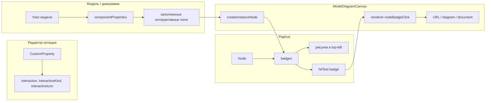

# Интерактивные кастомные свойства компонентов на диаграмме

Добавление возможности помечать кастомные свойства компонентов как «интерактивные» (внешняя ссылка, переход на диаграмму, документ и т.д.) с выбором иконки; на диаграмме у узлов с заполненными такими полями в левом верхнем углу рисуются кликабельные иконки, по клику выполняется действие (открытие URL, переход на диаграмму и т.д.).

## Текущее состояние

- **Компоненты нотаций** хранят в `attrs` (JSON) список `customProperties` ([notationAttrs.ts](src/features/notations/notationAttrs.ts)) — тип `CustomProperty` (id, name, type, required, defaultValue и т.д.). Нет флага «интерактивное» или типа действия.
- **Узлы модели** хранят значения этих свойств в `parsedAttrs.componentProperties[notationId][componentId]`; при отрисовке узла на диаграмме используются `getNodeComponentCustomProperties(modelNodeId)` и `getNodeScopedPropertyValues(modelNodeId)` ([ModelDiagramCanvas.vue](src/features/models/components/ModelDiagramCanvas.vue)).
- **Papirus**: узлы (`Node`) рисуют label, icon (один), порты; клик обрабатывается в `SelectionManager.handleClick` — `getElementAtPoint` возвращает узел/ребро/группу, затем выполняется select. Нет концепции «бейджей» или подэлементов с отдельным кликом.

## Архитектура решения

1. **Схема (нотация)**: расширить `CustomProperty` полями «интерактивное», тип действия, иконка.
2. **UI редактора компонентов**: в [CustomPropertiesPanel.vue](src/features/notations/components/CustomPropertiesPanel.vue) для каждого свойства — чекбокс «Показывать на диаграмме как кнопку», выбор типа действия (URL, диаграмма, документ и т.д.), выбор иконки — Material Symbols (см. п. 6).
3. **Papirus**: в базовый `Node` добавить опциональные `badges: Array<{ id: string; iconUrl: string }>`, отрисовка в левом верхнем углу (несколько иконок в ряд), метод `getBadgeAtPoint(point): { id: string; index: number } | null`, в `hitTest` не учитывать бейджи (клик по бейджу обрабатывается отдельно). В `SelectionManager.handleClick`: если под точкой узел и `node.getBadgeAtPoint(point)` не null — вызвать `renderer.emit('nodeBadgeClick', node.id, badge.id)` и выйти без смены выделения. Добавить событие `nodeBadgeClick` в `DiagramEvents`.
4. **warchi**: в `createInstanceNode` для каждого интерактивного свойства компонента, у которого у данного узла заполнено значение, добавить в `badges` элемент с `id: property.id`, `iconUrl` из свойства или дефолт; при синхронизации узла обновлять `node.badges`. Подписаться на `renderer.on('nodeBadgeClick', (nodeId, badgeId) => ...)`: по `nodeId` взять instanceId/modelNodeId, по badgeId — property id, взять значение из `componentProperties`, выполнить действие в зависимости от `interactiveKind` (открыть URL в новой вкладке, переход на диаграмму по id, открыть документ и т.д.).

## Детали реализации

### 1. Расширение типа CustomProperty (warchi)

**Файл:** [src/features/notations/notationAttrs.ts](src/features/notations/notationAttrs.ts)

- В тип `CustomProperty` добавить опциональные поля:
  - `interactive?: boolean`
  - `interactiveKind?: 'url' | 'diagram' | 'document'` (или строковый union для расширяемости)
  - `interactiveIcon?: string` (имя символа Material Symbols Outlined, например `link`, `open_in_new`, `description` — см. п. 6)
- В **normalizeCustomProperties**: в объект, возвращаемый для каждого свойства, явно добавить чтение из `record` полей `interactive`, `interactiveKind`, `interactiveIcon` (с приведением типов и дефолтами), иначе при загрузке старых/внешних данных эти поля не появятся после парсинга attrs.
- В `serializeEntityAttrs` через `stripInternalFlags` эти поля не трогать (убирается только `_fromType`).

### 2. UI в редакторе компонентов (warchi)

**Файл:** [src/features/notations/components/CustomPropertiesPanel.vue](src/features/notations/components/CustomPropertiesPanel.vue) (и при необходимости [PropertyRow.vue](src/features/types/components/PropertyRow.vue))

- В строке свойства (или в раскрывающихся опциях свойства) добавить:
  - Чекбокс «Интерактивное на диаграмме» → `interactive: true/false`.
  - При `interactive === true`: выбор типа действия (select: url / diagram / document) → `interactiveKind`, выбор иконки (select по списку имён Material Symbols, см. п. 6) → `interactiveIcon`.
- i18n: ключи для «Интерактивное», «Тип действия», «Иконка», варианты URL / Диаграмма / Документ.

### 3. Papirus: бейджи на узле

**Файлы:** Papirus (репозиторий papirus)

- **src/elements/Node.ts** (и типы в `NodeOptions`):
  - В `NodeOptions` добавить опциональное `badges?: Array<{ id: string; iconUrl: string }>`.
  - В классе `Node`: поле `_badges: Array<{ id: string; iconUrl: string }>`, сеттер/геттер `badges`, при set — `markDirty()`.
  - Константы: размер бейджа (например 16×16), отступ от угла, шаг между бейджами. Рисовать в `renderContents` (или отдельный `renderBadges`) в левом верхнем углу узла (в локальных координатах контента/inset), используя те же приёмы, что и для NodeImage (загрузка SVG/картинки или drawImage). Порядок: слева направо.
  - Метод `getBadgeAtPoint(point: Point): { id: string; index: number } | null`: точка в мировых координатах; перевести в локальные относительно узла, проверить попадание в прямоугольники бейджей (по тем же размерам/позициям, что и при рисовании); вернуть первый попавший бейдж (индекс и id).
- **DiagramRenderer.ts**: в `DiagramEvents` добавить `nodeBadgeClick: [nodeId: string, badgeId: string]`.
- **SelectionManager.ts**: в `handleClick` после `getElementAtPoint(point)`:
  - если `element` — экземпляр `Node` и у узла есть метод `getBadgeAtPoint` и `(element as Node).getBadgeAtPoint(point)` возвращает `{ id, index }`, то вызвать `this.renderer.emit('nodeBadgeClick', element.id, id)` и `return` (без смены выделения).

Экспорт типа для опций бейджа (если нужен в warchi) — через `index.ts`.

### 4. ModelDiagramCanvas: передача бейджей и обработка клика (warchi)

**Файл:** [src/features/models/components/ModelDiagramCanvas.vue](src/features/models/components/ModelDiagramCanvas.vue)

- Ввести функцию `getInteractiveBadgesForInstance(instance: DiagramNodeInstance): Array<{ id: string; iconUrl: string }>`:
  - взять modelNodeId, component по привязке нотации;
  - из `parseEntityAttrs(component.attrs)` взять `customProperties`;
  - из `getNodeScopedPropertyValues(modelNodeId)` взять значения;
  - для каждого свойства, у которого `interactive === true` и значение не пустое (строка/число — в зависимости от типа), добавить в массив `{ id: property.id, iconUrl: buildInteractiveBadgeIconUrl(property.interactiveIcon ?? 'link') }` (см. п. 6).
- В `createInstanceNode(instance)` в `commonOptions` передавать `badges: getInteractiveBadgesForInstance(instance)`.
- В **syncDiagram** в блоке обновления существующего узла in-place (рядом с `existing.icon = buildNodeIcon(ds)`) добавить: `existing.badges = getInteractiveBadgesForInstance(instance)` (при условии, что в Papirus у Node реализован setter `badges`).
- Ввести два новых эмита ModelDiagramCanvas: `openDiagram: [diagramId: string]` и `openDocument: [fileId: string]`.
- При инициализации рендерера подписаться на `renderer.on('nodeBadgeClick', (nodeId, badgeId) => { ... })`:
  - по `nodeId` из `nodeIdToInstance` получить `modelNodeId` и `instanceId`;
  - по компоненту узла и `badgeId` найти свойство в `customProperties`, получить `interactiveKind` и значение из `componentProperties`;
  - выполнить действие:
    - `url`: `window.open(value, '_blank')` (значение — строка URL);
    - `diagram`: `emit('openDiagram', value)` — значение есть id диаграммы (UUID) в рамках текущей модели;
    - `document`: `emit('openDocument', value)` — значение есть UUID файла документа.
- В **ModelEditor**: подписаться на `@open-diagram` и вызывать `selectDiagram(diagramId)` (переключение на эту диаграмму в текущей модели); подписаться на `@open-document` и открывать DocumentEditorModal с переданным `fileId` (при открытии по бейджу `docModalTarget` не устанавливать — только просмотр/редактирование файла по ID без привязки к узлу).

### 5. Действия по типам (уточнение)

- **url**: значение свойства — строка URL; открыть в новой вкладке (`window.open(value, '_blank')`).
- **diagram**: значение — id диаграммы (UUID) в рамках текущей модели. ModelDiagramCanvas эмитит `openDiagram(diagramId)`; ModelEditor обрабатывает и вызывает `selectDiagram(diagramId)` (диаграмма выбирается в дереве, при необходимости переключить вкладку на канвас).
- **document**: значение — UUID файла документа. ModelDiagramCanvas эмитит `openDocument(fileId)`; ModelEditor открывает DocumentEditorModal с этим `fileId`. При открытии по бейджу привязку к узлу не сохраняем (`docModalTarget = null`) — только просмотр/редактирование файла по ID.

### 6. Иконки для интерактивных свойств — Material Symbols

Иконки берём из **Material Symbols Outlined** (как в остальном UI приложения: `material-symbols-outlined`, см. CustomPropertiesPanel, ModelEditor и др.).

- **Хранение**: в `interactiveIcon` хранится имя символа (например `link`, `open_in_new`, `description`, `article`).
- **UI в CustomPropertiesPanel**: селект с фиксированным списком имён Material Symbols (конфиг по аналогии с [material-palette-icon-plan.md](material-palette-icon-plan.md) — массив имён для выбора). Превью в селекте: `{{ iconName }}`.
- **Отрисовка бейджей на канвасе (Papirus)**: у Node бейдж принимает `iconUrl: string`. В warchi нужна функция `buildInteractiveBadgeIconUrl(materialIconName: string): string`, возвращающая URL картинки для отрисовки. Варианты реализации: (a) подмножество Material-символов экспортировать в SVG и положить в `/public/icons/` (например `link.svg`, `open_in_new.svg`, `description.svg`) — тогда URL = `/icons/${materialIconName}.svg`; (b) в warchi по имени символа формировать data URL (рендер символа шрифтом Material в offscreen canvas, затем toDataURL). Рекомендация для первой итерации: вариант (a) — добавить в `/public/icons/` SVG для выбранного набора символов (совпадающие по начертанию с Material или экспорт из Material Icons).

- **Скрипт подстановки официальных Material SVG**: чтобы иконки в настройках (Material Symbols) и на диаграмме (SVG из `public/icons/`) совпадали, в проекте есть скрипт, копирующий официальные SVG из пакета `@material-design-icons/svg` (стиль outlined) в `public/icons/`. Список имён совпадает с [INTERACTIVE_BADGE_ICONS](src/config/interactiveBadgeIcons.ts). Запуск: `npm run copy:badge-icons` (перед этим нужна установка: `npm install` с devDependency `@material-design-icons/svg`). Файл скрипта: [scripts/copy-material-badge-icons.mjs](scripts/copy-material-badge-icons.mjs). При добавлении новой иконки в конфиг нужно добавить её id в массив `BADGE_ICON_IDS` в этом скрипте и перезапустить `copy:badge-icons`.

## Порядок работ

1. **notationAttrs**: расширить `CustomProperty` и нормализацию/сериализацию.
2. **CustomPropertiesPanel**: UI для interactive, interactiveKind, interactiveIcon.
3. **Papirus**: Node.badges (опции, отрисовка, getBadgeAtPoint), DiagramEvents.nodeBadgeClick, SelectionManager.handleClick — эмит nodeBadgeClick при клике по бейджу.
4. **ModelDiagramCanvas**: getInteractiveBadgesForInstance, передача badges в createInstanceNode и при sync, подписка на nodeBadgeClick и выполнение действий (url / diagram / document).
5. **i18n**: ключи для новых подписей и опций.

## Риски и упрощения

- **Papirus**: если не хочется трогать ядро, альтернатива — рисовать «бейджи» в warchi поверх канваса (HTML-слой с позиционированием по worldToScreen и обновлением при pan/zoom). Это усложнит синхронизацию и скролл. Рекомендация: реализовать бейджи в Node в Papirus для единообразия и корректного hit-test.
- Переход на диаграмму: id диаграммы в модели есть (UUID). Значение интерактивного свойства типа `diagram` хранит этот id; по клику вызывается `selectDiagram(diagramId)` — переключение на нужную диаграмму в текущей модели.
