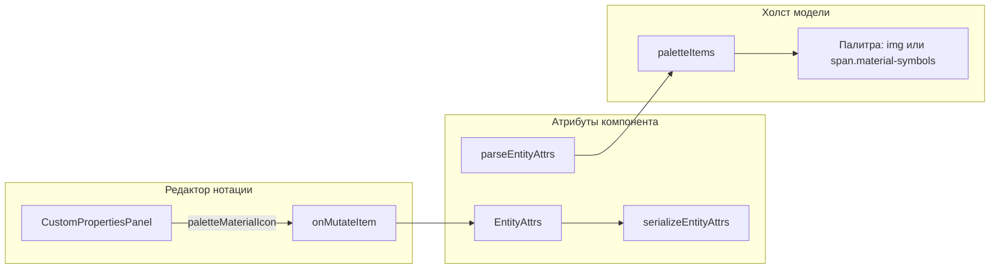

# Иконка палитры из Material для компонентов без иконки

## Текущее поведение

- Иконка в палитре берётся из `diagramStyle.iconName` (SVG из `/icons/*.svg`). Если иконки нет, используется заглушка `component.svg` ([ModelDiagramCanvas.vue](src/features/models/components/ModelDiagramCanvas.vue) ~2212, 2549).
- Редактирование стиля компонента (в т.ч. иконки узла) — в [NodeStylePanel.vue](src/features/notations/components/NodeStylePanel.vue) (секция «Иконка», только SVG через [availableIcons](src/config/availableIcons.ts)).
- Группа палитры и прочие атрибуты компонента редактируются в [CustomPropertiesPanel.vue](src/features/notations/components/CustomPropertiesPanel.vue) (компоненты: `!('linkTypeId' in selectedItem)`).

## Идея решения

- Ввести отдельное поле **только для палитры**: иконка из шрифта Material Symbols. **Использовать его только когда у компонента нет `diagramStyle.iconName`** — в палитре тогда показывать выбранную Material-иконку; если у компонента задана SVG-иконка узла, в палитре по-прежнему показывается она.
- Данные хранить в атрибутах сущности (компонента), а не в `diagramStyle`, так как это настройка отображения в палитре, а не на холсте.

## Изменения по файлам

### 1. Модель данных

- **[src/features/notations/notationAttrs.ts](src/features/notations/notationAttrs.ts)**  
  - В `EntityAttrs` добавить необязательное поле `paletteMaterialIcon?: string` (имя символа Material, например `"note"`, `"widgets"`).  
  - В `parseEntityAttrs`: читать `record.paletteMaterialIcon` (строка, trim), записывать в `result.paletteMaterialIcon`.  
  - В `serializeEntityAttrs`: при наличии `attrs.paletteMaterialIcon` добавлять в `result` и сериализовать.
- **[src/features/notations/types.ts](src/features/notations/types.ts)**  
  - В `EntityParsedAttrs` добавить `paletteMaterialIcon?: string`.

### 2. Конфиг Material-иконок

- **Новый файл [src/config/materialPaletteIcons.ts](src/config/materialPaletteIcons.ts)** (или расширить существующий config).  
  - Экспорт массива имён символов Material Symbols Outlined для выбора в палитре (например 40–80 штук: `note`, `palette`, `widgets`, `dashboard`, `person`, `business`, `category`, `folder`, `description`, `link`, `hub`, `account_tree`, `schema`, `table_chart`, `view_module`, `apps`, и т.п.).  
  - Экспорт варианта для `SearchableSelect`: `{ id: string, label: string }[]` (id = имя символа, label можно отображать как имя или с превью).

### 3. UI выбора иконки палитры (редактор нотации)

- **[src/features/notations/components/CustomPropertiesPanel.vue](src/features/notations/components/CustomPropertiesPanel.vue)**  
  - Секция только для компонентов (как у «Группа палитры»): показывать блок «Иконка для палитры» когда у компонента **нет** иконки узла (`!selectedItem.parsedAttrs.diagramStyle?.iconName`).  
  - Элемент управления: выпадающий список с поиском (`SearchableSelect`) по списку из `materialPaletteIcons`, с превью в виде `{{ name }}`.  
  - При выборе/очистке вызывать `onMutateItem` и записывать/удалять `parsedAttrs.paletteMaterialIcon`.  
  - Добавить ключи i18n (ru/en), например `diagram.paletteIcon`, `diagram.paletteIconHint`.

### 4. Отображение в палитре холста

- **[src/features/models/components/ModelDiagramCanvas.vue](src/features/models/components/ModelDiagramCanvas.vue)**  
  - В `paletteItems`: из `parseEntityAttrs(component.attrs)` уже приходят `diagramStyle` и при добавлении — `paletteMaterialIcon`. Добавить в объект элемента палитры флаг или имя: например `paletteMaterialIcon: parsedAttrs.paletteMaterialIcon?.trim() || undefined`.  
  - Логика отображения в шаблоне палитры (вместо одного ``):  
    - если есть `diagramStyle?.iconName` — по текущей логике показывать ``;  
    - иначе если есть `paletteMaterialIcon` — показывать `{{ paletteMaterialIcon }}`;  
    - иначе — текущий fallback ``.
  - Стили: для `.canvas-palette__icon` в режиме Material задать размер шрифта и цвет (например текущий `--palette-item-fill` или нейтральный), чтобы иконка вписывалась в кнопку палитры так же, как SVG.

### 5. Локализация

- **[src/i18n/messages.ts](src/i18n/messages.ts)**  
  - В секции `diagram` (или подходящей) добавить ключи для «Иконка для палитры» и подсказки (ru/en).

## Порядок приоритета в палитре

Иконка Material для палитры используется **только при отсутствии** `diagramStyle.iconName`:

1. Если задан `diagramStyle.iconName` — показывать SVG из `/icons/` (Material не используется).
2. Иначе, если задан `paletteMaterialIcon` — показывать символ Material.
3. Иначе — заглушка `component.svg`.

## Диаграмма потока данных

## Замечания

- На диаграмме (Papirus) иконка узла по-прежнему только из `diagramStyle.iconName` (SVG); Material используется только в палитре.  
- Список Material-символов в конфиге — ограниченный и подобранный под палитру; при необходимости его можно расширить или позже заменить на ввод произвольного имени с валидацией.  
- Релейшены не затрагиваются: выбор «иконки для палитры» только для компонентов (как и группа палитры).
