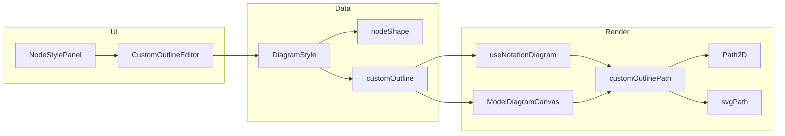

# План: пользовательская форма узла (контур по точкам перелома и Bezier)

## Цель

Сейчас форма выбирается только из списка (rectangle, diamond, circle, beveled-rectangle, trapezoid, slanted-rectangle). Нужно дать возможность создать свою форму: начать с прямоугольника и добавить на гранях точки перелома и/или сделать участки контура кривыми Bezier.

## Модель данных контура

Замкнутый контур задаётся последовательностью **сегментов** в **нормализованных координатах** (0 ≤ x,y ≤ 1), затем масштабируется по ширине и высоте узла.

- **Сегмент линии**: два пункта — начало и конец.
- **Сегмент Bezier (кубический)**: четыре пункта — начало, контрольная 1, контрольная 2, конец.

Структура (в `DiagramStyle`):

```ts
// Один сегмент: линия или кубическая кривая Безье
type OutlineSegment =
  | { type: 'line'; points: [[number, number], [number, number]] }
  | { type: 'bezier'; points: [[number, number], [number, number], [number, number], [number, number]] }

// Контур по умолчанию = прямоугольник (обход по часовой: верх, право, низ, лево)
const DEFAULT_RECTANGLE_OUTLINE: OutlineSegment[] = [
  { type: 'line', points: [[0, 0], [1, 0]] },
  { type: 'line', points: [[1, 0], [1, 1]] },
  { type: 'line', points: [[1, 1], [0, 1]] },
  { type: 'line', points: [[0, 1], [0, 0]] }
]
```

В `DiagramStyle` добавляем поле `customOutline?: OutlineSegment[]`. Если задано и `nodeShape === 'custom'`, форма узла строится по этому контуру. Сериализация в JSON уже поддерживается через `attrs` компонента/нотации.

## Изменения по слоям

### 1. Типы и нормализация

- **notationAttrs.ts**: описать тип `OutlineSegment` и тип `CustomOutline` (массив сегментов). В `DiagramStyle` добавить `customOutline?: OutlineSegment[]`. В `normalizeDiagramStyle` добавить разбор и валидацию `customOutline` (массив объектов с `type` и `points`, проверка длины и диапазона 0..1).

### 2. Построение Path2D и SVG path из контура

- **Новый модуль** (например `src/utils/customOutlinePath.ts`): функции
  - `customOutlineToPath2D(segments: OutlineSegment[], width: number, height: number): Path2D`
  - `customOutlineToSvgPath(segments: OutlineSegment[], width: number, height: number): string`
  Масштабирование: нормализованную точку (x, y) превращать в (x * width, y * height). Обход сегментов: moveTo первого пункта, затем для каждого сегмента lineTo/bezierCurveTo и в конце closePath (или явно вернуться в первую точку).

### 3. Рендер и экспорт

- **useNotationDiagram.ts** и **ModelDiagramCanvas.vue**: в ветке создания узла по форме добавить условие: если `nodeShape === 'custom'` и в `ds` есть валидный `customOutline`, создавать `CustomShapeNode` с `path` и `svgPath` из билдера контура. Иначе при `custom` без контура — fallback на прямоугольник.
- Тип `ComponentShape` расширить на `'custom'` в обоих местах; в diagramShapes custom не добавлять (он строится динамически из данных).

### 4. UI выбора формы

- **NodeStylePanel.vue**: в `NODE_SHAPE_OPTIONS` добавить опцию `{ value: 'custom', labelKey: 'nodeStyle.shapeCustom' }`. При выборе «Своя форма» показывать кнопку «Редактировать контур». При загрузке стиля узла: если в `diagramStyle` есть `customOutline`, выставлять `nodeShape = 'custom'`.
- Добавить переводы для `nodeStyle.shapeCustom` и подписи к редактору контура (ru/en).

### 5. Редактор контура (Custom outline editor)

Редактор — отдельный компонент (модальное окно или панель), который получает/возвращает `OutlineSegment[]`.

**Фаза 1 — полигон (точки перелома):**

- Старт: контур = прямоугольник (4 линейных сегмента).
- Холст в нормализованных координатах (0,0)–(1,1), отображаемый в фиксированном размере (например 280×160).
- **Добавление точки**: клик по ребру контура — вставка новой точки на ребре (разбиение одного линейного сегмента на два).
- **Перетаскивание точки**: drag существующей вершины — обновление координат (оставить в пределах 0..1).
- **Удаление точки**: для вершины, не являющейся углом прямоугольника, кнопка «Удалить» или контекстное меню — склеить два соседних сегмента в один.
- Сохранение: эмит обновлённого `customOutline` в родителя; родитель кладёт его в `diagramStyle` и вызывает `style-change`.

**Фаза 2 — сегменты Bezier:**

- Для любого сегмента опция «Сделать кривой»: заменить сегмент на кубический Bezier с контрольными точками (по умолчанию на 1/3 и 2/3 вдоль отрезка).
- На холсте отображать контрольные точки; перетаскивание контрольных и концов сегмента обновляет `points` сегмента.
- Переключатель «Кривая» / «Линия» для сегмента — менять `type` и при необходимости конвертировать line ↔ bezier.

Технически: один компонент, например `CustomOutlineEditor.vue`, с внутренним состоянием `segments`, пропсами `modelValue`, эмитом `update:modelValue`. Рисование: canvas или SVG (SVG проще для hit-test по рёбрам и точкам).

### 6. Связка с панелью стиля

- В NodeStylePanel при `nodeShape === 'custom'` показывать блок «Контур» с кнопкой «Редактировать контур»; по клику открывать модал с `CustomOutlineEditor`. При первом выборе «Своя форма» без `customOutline` инициализировать `diagramStyle.customOutline` копией `DEFAULT_RECTANGLE_OUTLINE`.
- При сохранении из редактора — обновлять `currentDiagramStyle.customOutline` и вызывать emit `style-change`.

## Порядок реализации

1. Типы и нормализация (`OutlineSegment`, `DiagramStyle.customOutline`, `normalizeDiagramStyle`).
2. Модуль `customOutlinePath.ts` (Path2D + svgPath).
3. Интеграция в useNotationDiagram и ModelDiagramCanvas (ветка `nodeShape === 'custom'`).
4. Опция «Своя форма» в NodeStylePanel и инициализация `customOutline` по умолчанию.
5. Компонент редактора контура: сначала только полигон (вставка/перемещение/удаление точек на прямоугольнике), затем опционально Bezier.

## Риски и ограничения

- Валидация контура: замкнутость (первая и последняя точка должны совпадать или мы автоматически замыкаем path), несамопересечения не проверяем в первой версии.
- Производительность: при большом числе сегментов пересчёт Path2D при каждом resize — обычно приемлемо; при необходимости можно кэшировать по хешу segments + w + h.
- Редактор контура — самая объёмная часть; разумно сначала сделать только «прямоугольник + точки перелома» (фаза 1), затем добавлять Bezier (фаза 2).

## Схема потока данных



Итог: пользователь может выбрать «Своя форма», отредактировать контур (прямоугольник с точками перелома и при желании участками Bezier), данные хранятся в `diagramStyle.customOutline`, отрисовка и экспорт в SVG используют один и тот же контур через общий билдер Path2D/svgPath.
