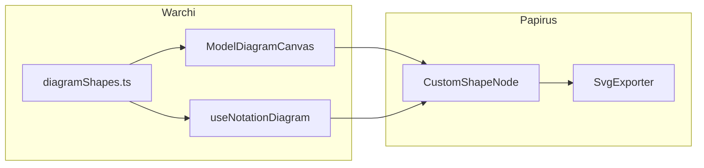

# План: поддержка outline и экспорта для кастомных форм Warchi

## Текущее состояние

**Papirus** (`papirus/src/elements/nodes/CustomShapeNode.ts`):
- **Вид**: отрисовка по `path` (Path2D).
- **Форма для стрелки**: те же методы outline — `getOutlineSample()`, `getConnectionPointAtOutlineParam()`, `getClosestPointOnOutline()`, `getOutlinePointToward()` — считаются по тому же Path2D (дискретизация контура, ray casting). То есть при наличии `path` стрелка уже может идти по контуру фигуры при `attachToOutline: true`.
- **SVG-экспорт**: `SvgExporter.ts` для `CustomShapeNode` вызывает `getSvgPath()`. Если `svgPath` не задан — рисуется `<rect>` (bounding box). То есть без `svgPath` экспорт не отражает реальную форму.

**Warchi** — кастомные формы:
- **beveled-rectangle**: `CustomShapeNode` с `path: createBeveledRectanglePath`, без `svgPath`.
- **trapezoid**: `path: createTrapezoidPath`, без `svgPath`.
- **slanted-rectangle**: `path: ShapeFactories.parallelogram`, без `svgPath`.
- **sticky note**: `path: createStickyNotePath`, без `svgPath`.

Path задаётся в двух местах с дублированием:
- `src/features/models/components/ModelDiagramCanvas.vue` (строки 799–835, 1020–1055)
- `src/features/notations/composables/useNotationDiagram.ts` (строки 142–166, 439–461)

В редакторе моделей включён `attachToOutline: true` (ModelDiagramCanvas.vue ~1618–1622), поэтому привязка стрелки к контуру для этих узлов уже должна работать на уровне Papirus. Проблема «не поддерживают» на практике проявляется в **SVG-экспорте**: при вызове SvgExporter из ModelEditor.vue и useNotationExport.ts кастомные узлы уходят в экспорт как прямоугольники.

## Цель изменений

1. **Корректный SVG-экспорт** для всех кастомных форм: при экспорте в SVG узлы должны отображаться той же формой (beveled, trapezoid, slanted, sticky note), а не rect.
2. **Единый источник правды** для path и svgPath: убрать дублирование между модельным канвасом и редактором нотаций.

Изменения только в **Warchi**; Papirus не трогаем.

## Шаги реализации

### 1. Общий модуль форм диаграмм

Создать модуль `src/utils/diagramShapes.ts` (или `src/features/models/diagramShapes.ts`), который экспортирует для каждой формы:
- фабрику Path2D `(width, height) => Path2D`,
- фабрику SVG path `(width, height) => string`.

Формы:
- **beveled-rectangle** — логика как в текущем `createBeveledRectanglePath` (cut = min(w,h)*0.16); SVG path в координатах 0..w, 0..h.
- **trapezoid** — как `createTrapezoidPath` (topInset = w*0.18); аналогично SVG.
- **slanted-rectangle** — переиспользовать `ShapeFactories.parallelogram` и `ShapeFactories.svg.parallelogram` из Papirus.
- **sticky-note** — как `createStickyNotePath` (cut = max(10, min(w,h)*0.2)); SVG path с тем же контуром.

### 2. Подключение в ModelDiagramCanvas.vue

- Удалить локальные `createBeveledRectanglePath`, `createTrapezoidPath`, `createStickyNotePath`.
- Импортировать фабрики из общего модуля.
- При создании `CustomShapeNode` для beveled-rectangle, trapezoid, slanted-rectangle и sticky note передавать и `path`, и `svgPath`.

### 3. Подключение в useNotationDiagram.ts

- Убрать дублирующие `createBeveledRectanglePath` и `createTrapezoidPath`, импорт из общего модуля.
- При создании `CustomShapeNode` для beveled, trapezoid, slanted задавать `path` и `svgPath` из модуля.

### 4. Проверка

- Редактор моделей: узлы beveled, trapezoid, slanted, sticky note; привязка связей к контуру; экспорт в SVG — формы в файле соответствуют отрисовке.
- Редактор нотаций: компоненты с этими формами и экспорт в SVG — узлы не как rect.

## Зависимости и риски

- Papirus уже экспортирует `ShapeFactories.svg.parallelogram` — для slanted-rectangle достаточно передать его в `svgPath`.
- SVG path для beveled, trapezoid и sticky note нужно описать вручную так, чтобы геометрия совпадала с Path2D (те же коэффициенты 0.16, 0.18, 0.2).

## Схема

После изменений: оба места создания узлов используют общий модуль; при создании CustomShapeNode всегда передаются `path` и `svgPath`; вид, контур для стрелки и SVG-экспорт совпадают для всех кастомных форм.
