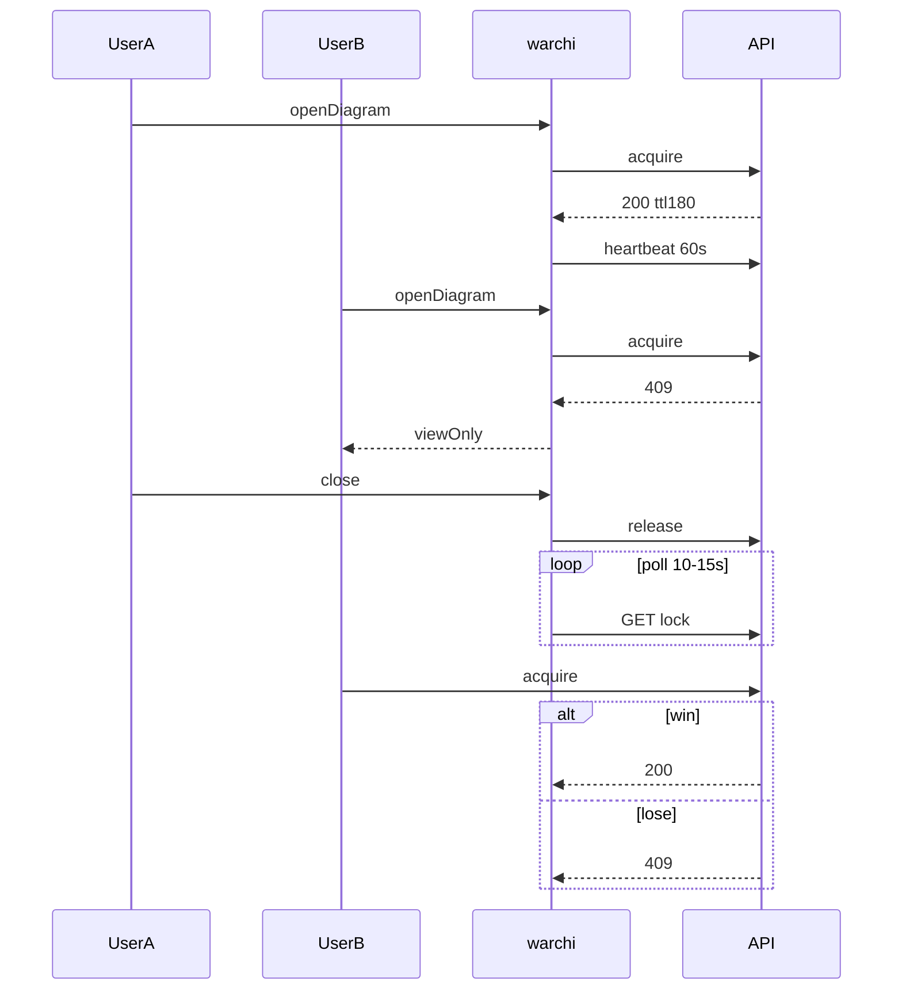

# Блокировки редактирования диаграммы

**Связанные планы:** [индекс](modeling-collaboration-index.md) · [синхронизация модели](model-live-sync.md) · [конфликты batch-save](model-batch-save-conflicts.md)

## Зафиксированные решения

- Блокировка на **запись диаграммы** (`diagramId`, версия).
- Heartbeat **60 с**, TTL **180 с**.
- **Снятие блокировки:** только **администратор** (`force-release`).
- Viewer после `release`: баннер **«освободилась»** + CTA **«Перейти в редактирование»**; если `diagramUpdatedAt` новее — **«обновилась»** + **«Перезагрузить»**.
- Гонка нескольких viewers: **first-come-first-served** через атомарный `acquire`; проигравшие — **409** с метаданными держателя.
- **Тот же пользователь** после краша браузера: `acquire` при живом lock → **200** + продление `expires_at` (идемпотентно).

## Backend

### Модель данных

- Таблица `diagram_edit_locks`: `diagram_id` (unique), `locked_by_user_id`, `locked_at`, `last_heartbeat_at`, `expires_at`; индексы по `expires_at`, `locked_by_user_id`.
- JPA + репозиторий рядом с [Diagrams.kt](../../../arepos-server/src/main/kotlin/ru/kavader/arepos/model/Diagrams.kt) (соседний репозиторий `arepos-server`).

### API (`DiagramsController`-стиль)

- `POST /api/v1/diagram-locks/{diagramId}/acquire`
- `POST /api/v1/diagram-locks/{diagramId}/heartbeat`
- `POST /api/v1/diagram-locks/{diagramId}/release`
- `GET /api/v1/diagram-locks?modelId=...`
- `POST /api/v1/diagram-locks/{diagramId}/force-release` — только `canViewAdminPanel`

Права: acquire/heartbeat/release — `canEditDiagram`.

**Acquire:** свободно/истекло → выдать; тот же user → 200 + refresh TTL; другой user → 409 + `reason: LOCKED_BY_OTHER`, `lockedBy*`, `expiresAt`, `diagramUpdatedAt`.

**Параллельные acquire:** один 200, остальные 409 (одинаковое тело).

### Контракт GET / 409

- `diagramId`, `isLocked`, `lockedByUserId`, `lockedByDisplay`, `expiresAt`, `diagramUpdatedAt`.

### TTL

- Scheduler каждые 30–60 с: удалить lock с `expires_at < now()`.
- Heartbeat: обновить `last_heartbeat_at`, `expires_at = now() + 180s`.

## Frontend

- [ModelEditor.vue](../../src/features/models/ModelEditor.vue): при открытии диаграммы `acquire`; успех → edit; 409 → `readOnly` ([ModelDiagramCanvas.vue](../../src/features/models/components/ModelDiagramCanvas.vue)); heartbeat 60 с; `release` на смене/закрытии/beforeunload.
- Composable `useDiagramLock`.
- Viewer: poll lock **10–15 с**; баннеры + CTA + повторный `acquire`.
- [ModelTreePalettePanel.vue](../../src/features/models/components/ModelTreePalettePanel.vue): бейджи; i18n [models.ts](../../src/i18n/locales/models.ts) / [auth.ts](../../src/i18n/locales/auth.ts).
- Админ: [router](../../src/router/index.ts) `/admin/diagram-locks`, [AdminLayout.vue](../../src/layouts/AdminLayout.vue), страница по образцу [AdminDeletedView.vue](../../src/views/AdminDeletedView.vue).

## Состояния viewer (кратко)

- `EditLockedByMe` | `ViewOnlyLockedByOther` | `ViewOnlyUnlocked` до CTA.

## Тесты

- Backend: acquire/heartbeat/release/force-release, TTL, идемпотентность, N параллельных acquire, тот же user повторно.
- Frontend: composable, viewer locked→unlocked, гонка acquire, дерево, smoke админки.

## Диаграмма

## Риски

- Сеть и heartbeat: запас TTL 180 с.
- Acquire: транзакция + unique `diagram_id`.
- Задержка UI: optimistic + poll; при необходимости позже WS/SSE.

## Перспектива: совместное редактирование одной диаграммы

Текущий дизайн — **один пишущий** на `diagramId`. Для **нескольких редакторов на одном canvas** понадобится отдельный контур (операции/seq, CRDT или серийный журнал на сервере, debounce save в БД). Не смешивать с низкочастотной шиной модели: см. [model-live-sync.md](model-live-sync.md) (раздел «Эволюция архитектуры») и [collaborative-editing-plan.md](../collaborative-editing-plan.md).

## Чеклист задач (кратко)

- Таблица `diagram_edit_locks` + Liquibase
- API acquire / heartbeat / release / list / force-release + права
- Scheduler очистки TTL
- `useDiagramLock` + ModelEditor + poll viewer
- Бейджи в дереве + i18n
- Админ-вкладка `/admin/diagram-locks`
- Тесты бэкенда и фронта
