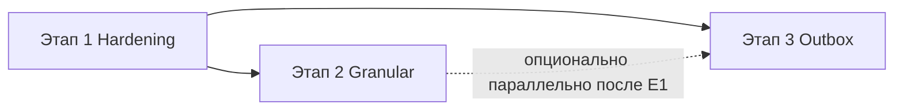

# Model Live Sync — план этапов 1–3 (Hardening → Granular → Outbox)

**Связанные документы:** [gap / go–no-go](model-live-sync-gap-go-no-go.md) · [архитектура и контракт](model-live-sync.md)

## Цель

Свести в один исполнимый план три этапа из gap-документа: **стабилизировать текущий signal+pull**, затем **снизить нагрузку и дёргание за счёт гранулярных событий**, затем **гарантировать доставку через outbox**.

## Область и репозитории

| Этап | warchi | arepos-server | papirus |
|------|--------|---------------|---------|
| 1 | да (`useModelLiveSync`, merge) | да (`ModelSyncBroadcaster`, контроллеры) | нет |
| 2 | да (роутер, коалесцер, patch) | да (события, revision, API при необходимости) | обычно нет |
| 3 | минимально (метрики/логи при желании) | да (outbox, воркер, миграции) | нет |

Точки входа сегодня:

- Клиент: [`src/features/models/composables/useModelLiveSync.ts`](../../src/features/models/composables/useModelLiveSync.ts), [`ModelEditor.vue`](../../src/features/models/ModelEditor.vue), [`modelEntityMerge.ts`](../../src/features/models/utils/modelEntityMerge.ts).
- Сервер: [`ModelSyncBroadcaster.kt`](../../../arepos-server/src/main/kotlin/ru/kavader/arepos/service/ModelSyncBroadcaster.kt) и вызовы из `ModelBatchSaveController`, `NodesController`, `LinksController`, `DiagramsController`, `ModelsController`.

## Зависимости между этапами

- **Этап 2** опирается на **идентификацию сообщений** (`eventId`) и наблюдаемость из этапа 1; контракт granular-событий лучше фиксировать поверх уже единого envelope.
- **Этап 3** можно начинать после этапа 1 **параллельно** с этапом 2: outbox заменяет *транспорт публикации*, не ломая клиентский контракт, если публикация в topic остаётся той же по JSON.

Рекомендуемый порядок внедрения: **1 → (2 и/или 3 по приоритету)**. Если критична потеря событий — сдвинуть **3 раньше 2**; если критичны лаги от полного pull — **2 раньше или вместе с ранней фазой 3**.

---

## Этап 1 — Hardening (signal + pull)

**Ориентир:** ~14 SP, один спринт команды, см. A1–A6 в gap-документе.

### 1.1 Порядок работ (рекомендуемый)

1. **A1 — Backend: `eventId` в envelope**  
   - Для каждого исходящего сообщения в `/topic/models/{modelId}` добавить уникальный **`eventId`** (UUID v4 или ULID).  
   - Унифицировать поля для `model_changed` и при необходимости для `diagram_live` / `diagram_pointer` / `diagram_spectators` (хотя бы `eventId` + `v`).  
   - **Критерий готовности:** в логах/тестах видно стабильное поле; старые клиенты не ломаются (поле опционально обрабатывается).

2. **A2 — Frontend: LRU-дедуп по `eventId`**  
   - В `useModelLiveSync`: перед триггером pull по `model_changed` проверять `eventId`; при повторе — инкремент счётчика дедупа, **без** pull.  
   - Размер LRU (например 256–512) и политика при отсутствии `eventId` (как сейчас — полагаться на `actorUserId` + pull).  
   - **Критерий готовности:** повтор одного и того же сообщения не вызывает второй merge подряд.

3. **A3 — Telemetry**  
   - События: `ws_message_received`, `ws_message_deduped`, `pull_trigger_reason` (enum: `stomp_model_changed`, `reconnect`, `visibility`, `poll_fallback`, `initial`, …).  
   - Реализация: существующий способ продуктовой аналитики в warchi (или временно `console` за флагом dev — по принятому в проекте стандарту).  
   - **Критерий готовности:** на дашборде/в логах можно ответить: «сколько pull на сессию» и «сколько дедупов».

4. **A4 — Backend tests**  
   - Интеграционные или WebSocket-тесты: мутация → сообщение в topic с ожидаемыми полями (`type`, `modelId`, `eventId`, …).  
   - **Критерий готовности:** регрессия на забытую публикацию после нового эндпоинта ловится CI.

5. **A5 — Frontend tests**  
   - Vitest: dedup, reconnect pull, сочетание с `actorUserId`.  
   - **Критерий готовности:** сценарии из gap-документа покрыты автотестами.

6. **A6 — Docs**  
   - Обновить [model-live-sync.md](model-live-sync.md): статус этапа 1, поля envelope, поведение дедупа.

### 1.2 Риски и смягчение

| Риск | Смягчение |
|------|-----------|
| Клиенты кэша/прокси дублируют WS-кадры | LRU + идемпотентный merge уже помогают; этап 2 уменьшит цену pull |
| `eventId` только на сервере, без часов клиента | Достаточно для дедупа; ordering не требуется на этапе 1 |

### 1.3 Вехи

- **M1:** A1+A2 в staging, ручная проверка двумя браузерами.  
- **M2:** A3+A4+A5+A6, релиз.

---

## Этап 2 — Granular push + coalescing

**Ориентир:** ~30 SP, 1–2 спринта, B1–B6.

### 2.1 Порядок работ (рекомендуемый)

1. **B1 — Backend: granular-события**  
   - Типы: `node_created` | `node_updated` | `node_deleted`, `link_*`, при необходимости `diagram_updated`.  
   - Минимальный payload (id + нужные поля / патч).  
   - Публикация в тот же topic или отдельный sub-channel — зафиксировать в B6; проще начать с **того же topic**, новый `type` в теле сообщения.  
   - **Совместимость:** сохранить `model_changed` как fallback (редкие операции, миграции, «не смогли разложить»).

2. **B2 — Backend: `revision`**  
   - Монотонный счётчик на сущность (или на модель — решение проектирования) в БД или вычисляемый seq; отдавать в каждом granular-событии.  
   - **Критерий готовности:** клиент может сравнить «какое новее» без NTP на клиентах.

3. **B3 — Frontend: роутер + коалесцер**  
   - Ключ слота: `entity:id` (как в [model-live-sync.md](model-live-sync.md)).  
   - LWW по `revision` / `updatedAt`, приоритет `*_deleted` над update/create.  
   - Flush очереди батчем в `requestAnimationFrame` или микротаск — согласовать с текущим Vue-циклом, чтобы не блокировать UI.

4. **B4 — Frontend: применение патча + fallback**  
   - Применение к `ModelEditorState` без полного GET там, где payload достаточен.  
   - При неизвестном типе, дыре в revision, конфликте версий — **один** `pullRemoteSnapshot` (с дедупом по `eventId` из этапа 1).  
   - Переиспользовать правила merge из `modelEntityMerge` где возможно; вынести общую логику при необходимости.

5. **B5 — Tests**  
   - Coalesce, delete vs update, reorder, идемпотентность, fallback pull.

6. **B6 — Docs/API**  
   - Зафиксировать JSON-схему в `model-live-sync.md` или OpenAPI companion; версия `v` envelope.

### 2.2 Риски

| Риск | Смягчение |
|------|-----------|
| Расхождение patch vs истина в БД | Явный fallback pull + сохранение `model_changed` для «тяжёлых» операций |
| Сложность batch-save (много сущностей) | Одно сообщение-обёртка с массивом `events` (как в черновике контракта в model-live-sync.md) + коалесцер на развёрнутом потоке |
| Двойная нагрузка: и granular, и model_changed | На переходный период слать только granular; `model_changed` — по флагу или для подписчиков старой версии клиента |

### 2.3 Вехи

- **M1:** B1+B2+B6 (контракт согласован), клиент ещё только pull по `model_changed` — можно катить сервер раньше фронта при обратной совместимости.  
- **M2:** B3+B4 в feature-ветке, dogfood.  
- **M3:** B5, срезание частоты full pull в метриках A3.

---

## Этап 3 — Outbox и надёжная доставка

**Ориентир:** ~23 SP, C1–C5.

### 3.1 Порядок работ (рекомендуемый)

1. **C1 — Таблица outbox + запись в одной транзакции с доменной мутацией**  
   - Поля: `id`, `model_id`, `payload` (JSON), `created_at`, `published_at`, `attempts`, опционально `last_error`.  
   - Запись outbox в том же `@Transactional`, что и изменение модели.

2. **C2 — Воркер**  
   - Поллинг или transactional outbox pattern: читать неопубликованные, слать в `SimpMessagingTemplate`, помечать `published_at`.  
   - Retry с exponential backoff, dead-letter / алерт после порога.

3. **C3 — Метрики**  
   - `outbox_lag_ms` (now - created_at для неопубликованных), `publish_failures_total`, `outbox_retries_total`.  
   - Экспорт в Prometheus (в проекте уже есть actuator/prometheus).

4. **C4 — Tests**  
   - Симуляция падения после commit БД до send; повторная публикация без дубликата в UI на стороне клиента (этап 1) или идемпотентный ключ на уровне сообщения.

5. **C5 — Runbook**  
   - Что делать при росте lag, при забитом outbox, при отключённом брокере.

### 3.2 Связь с этапами 1–2

- Outbox публикует **те же JSON**, что сегодня шлёт `ModelSyncBroadcaster` напрямую; после этапа 2 — granular + при необходимости `model_changed`.  
- **`eventId`** лучше генерировать при постановке в outbox (один id на запись outbox = одна доставка в семантике клиента).

### 3.3 Риски

| Риск | Смягчение |
|------|-----------|
| Задержка доставки vs прямой send | Приемлемо для модели « eventual »; для pointer/live при необходимости оставить прямой путь или отдельный низколатентный канал (вне этапа 3) |
| Объём таблицы | Ретеншн/archiving опубликованных записей по расписанию |

### 3.4 Вехи

- **M1:** C1+C2 в dev с локальным брокером.  
- **M2:** C3+C4, нагрузочный смоук.  
- **M3:** C5 + прод-включение по флагу/постепенный rollout.

---

## Сводная таблица спринтов (предложение)

| Спринт | Фокус | Основной вывод |
|--------|--------|----------------|
| **S1** | Этап 1 полностью (A1–A6) | Меньше лишних pull, метрики, тесты |
| **S2** | Decision gate; старт B1–B3 и/или C1–C2 | Либо granular+revision+коалесцер, либо outbox-скелет |
| **S3** | B4–B6 и/или C3–C5 | Меньше full snapshot в UI или надёжная доставка в проде |

**Decision gate для этапа 2** (повтор из gap-документа): рост pull на сессию, жалобы на задержки, update storm, деградация догона после reconnect — любой из сигналов оправдывает ускорение B-задач.

---

## Чеклист готовности «этап закрыт»

- **Этап 1:** `eventId` в прод-сообщениях; клиент дедупит; телеметрия показывает причины pull; CI зелёный; док обновлён.  
- **Этап 2:** контракт и revision задокументированы; коалесцер покрыт тестами; в happy-path нет полного GET на каждую мелкую правку; fallback pull работает.  
- **Этап 3:** outbox в пути критических мутаций; воркер с ретраями; метрики в дашборде; runbook одобрен ops.

---

## Ветвление (workflow из правил репозитория)

Одна feature-ветка на этап или на крупный блок (например `feat/model-live-sync-hardening`) во **всех** затронутых репозиториях: **warchi**, **arepos-server**; для локальной разработки warchi — `papirus` как `file:../papirus` по необходимости (см. workspace rules).
