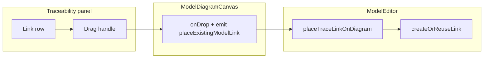

# Трассировка: стиль по активной диаграмме + DnD связи на canvas

## Текущий срез (24.03.2026)

- В проекте уже есть панель трассировки: [`ModelTraceabilityPanel.vue`](../../src/features/models/components/ModelTraceabilityPanel.vue) + [`ModelTraceBranch.vue`](../../src/features/models/components/ModelTraceBranch.vue).
- Трассировка сейчас рендерит дерево и навигацию, но **не учитывает activeDiagram** для стилей link-строк.
- В canvas DnD поддерживает `application/x-notation-component-id`, `application/x-model-node-id`, `application/x-model-diagram-note`, но **не** `application/x-warchi-model-link-id` (см. [`ModelDiagramCanvas.vue`](../../src/features/models/components/ModelDiagramCanvas.vue)).
- В редакторе уже есть готовый механизм использования существующей связи: `handleSelectExistingLink(linkId)` + `createOrReuseLink(linkId)` при заполненном `pendingConnection` (см. [`ModelEditor.vue`](../../src/features/models/ModelEditor.vue)).
- В `models`-локалях нет строк для причин “почему link нельзя перетащить” из трассировки.

## Цель

Сделать в трассировке быстрый визуальный ответ и прямое действие:

- **жирный** — связь уже есть на текущей диаграмме;
- *курсив* — связи на текущей диаграмме нет (и её можно добавить);
- drag этой связи из панели сразу на canvas с созданием edge-инстанса для существующего `EditorLink`.

## Границы и допущения

- Backend не меняется.
- Формат `diagram.attrs.instances.edges[].modelLinkId` не меняется.
- Drag разрешается только когда связь реально может быть размещена на активной диаграмме.
- Если активной диаграммы нет или она read-only, панель остаётся информативной, но без drag.

## План реализации

### 1) Жирный / курсив в дереве трассировки

Правило отображения относительно активной диаграммы:

- `activeDiagram` отсутствует -> нейтральный стиль;
- `link.id` присутствует в `activeDiagram.parsedAttrs.instances.edges[].modelLinkId` -> текст связи `font-weight: 600`;
- отсутствует -> `font-style: italic`.

Технически:

- в `ModelEditor` собрать `Set<string>` linkId активной диаграммы;
- пробросить в `ModelTraceabilityPanel` и далее в `ModelTraceBranch`;
- в `ModelTraceBranch` добавить классы, например `tb__link--on-diagram` / `tb__link--missing-on-diagram`.

### 2) Drag-and-drop “отсутствующей” связи на canvas

Новый payload: `application/x-warchi-model-link-id = link.id`.

Разрешать drag только если одновременно:

- есть `activeDiagram` и режим не read-only;
- такой `link.id` ещё не размещён на диаграмме;
- на диаграмме есть инстансы для `link.sourceId` и `link.targetId`;
- есть relation для пары (`activeNotationId`, `link.linkTypeId`);
- `canConnect(sourceId, targetId)` разрешает связь.

Интеграция:

- `ModelTraceBranch`: drag-handle на строке связи, `@dragstart`/`@dragend`.
- `ModelDiagramCanvas`: расширить `isAllowedDropEvent/onDragOver/onDrop`, добавить emit `placeExistingModelLink(linkId)`.
- `ModelEditor`: обработчик `placeTraceLinkOnDiagram(linkId)`:
  - повторная валидация условий (защита от гонок);
  - поиск `sourceInstanceId/targetInstanceId`;
  - установка `pendingRelationId` + `pendingConnection`;
  - вызов существующего `createOrReuseLink(linkId)`.

Координаты drop для ребра не обязательны: геометрия строится по endpoint-инстансам.

### 3) Локализация + тесты

- Добавить i18n-ключи в [`src/i18n/locales/models.ts`](../../src/i18n/locales/models.ts):
  - подсказка drag;
  - причины disabled-состояния (`alreadyOnDiagram`, `missingEndpointInstances`, `missingRelation`, `connectNotAllowed`, `readOnly`, `noActiveDiagram`).
- Добавить unit-тесты для чистой функции вычисления статуса link в трассировке:
  - вход: `link`, `activeDiagram`, `activeNotationId`, `relations`, `nodesOnDiagram`, `readOnly`, `canConnect`;
  - выход: `{ onDiagram: boolean, draggable: boolean, reason?: string }`.

## Acceptance criteria

- При открытой диаграмме link-строки в трассировке явно различаются по состоянию (жирный/курсив).
- “Отсутствующая” связь перетаскивается из трассировки на canvas и создаётся как edge существующего `EditorLink`.
- Drag недоступен в невалидных состояниях и сообщает понятную причину (tooltip/i18n).
- Повторный drop той же связи не создаёт дубль.

## Затронутые файлы

| Файл | Изменения |
| --- | --- |
| [`ModelEditor.vue`](../../src/features/models/ModelEditor.vue) | Проброс статуса activeDiagram в трассировку; `placeTraceLinkOnDiagram`; обработчик emit от canvas |
| [`ModelTraceabilityPanel.vue`](../../src/features/models/components/ModelTraceabilityPanel.vue) | Приём/проброс данных о link-id активной диаграммы |
| [`ModelTraceBranch.vue`](../../src/features/models/components/ModelTraceBranch.vue) | Визуальные состояния link; drag-handle; tooltip причин disable |
| [`ModelDiagramCanvas.vue`](../../src/features/models/components/ModelDiagramCanvas.vue) | Поддержка DnD payload для model-link + emit |
| [`src/i18n/locales/models.ts`](../../src/i18n/locales/models.ts) | Новые строки для drag/disable причин |
| Новый `*.test.ts` | Тесты вычисления статуса link (onDiagram/draggable/reason) |

Backend/papirus не требуются.
