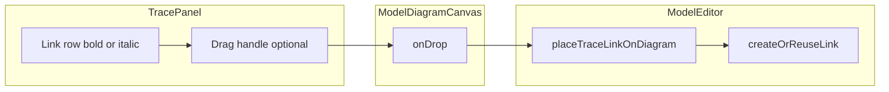

# План: трассировка (жирный/курсив) и перетаскивание связи на диаграмму

## Контекст в коде

- Панель трассировки: [`ModelTraceabilityPanel.vue`](../../src/features/models/components/ModelTraceabilityPanel.vue) + [`ModelTraceBranch.vue`](../../src/features/models/components/ModelTraceBranch.vue) — строки связей в `.tb__link`.
- Текущая диаграмма и нотация: `activeDiagram` / `activeNotationId` в [`ModelEditor.vue`](../../src/features/models/ModelEditor.vue).
- На диаграмме ребро хранится в `diagram.parsedAttrs.instances.edges[]` с полем `modelLinkId` (совпадает с `EditorLink.id`).
- Добавление **существующей** модельной связи на холст уже реализовано цепочкой `handleSelectExistingLink` → `createOrReuseLink(linkId)` при заполненном `pendingConnection` (источник/цель — `sourceInstanceId` / `targetInstanceId`). См. ~2583–2690 в `ModelEditor.vue`.

## 1. Жирный / курсив в дереве трассировки

**Правило:** сравниваем каждую отображаемую в дереве связь `EditorLink` с **активной** диаграммой (если она открыта и не read-only в контексте отображения — достаточно факта «есть `activeDiagram`»).

- Собрать `Set` из `modelLinkId` всех рёбер `activeDiagram.parsedAttrs.instances.edges` (игнорировать только диаграмменные/заметочные префиксы по аналогии с [`isDiagramOnlyEdgeModelLinkId`](../../src/features/models/ModelEditor.vue), если такие `modelLinkId` теоретически попадут в дерево — обычно нет).
- Для строки связи в [`ModelTraceBranch.vue`](../../src/features/models/components/ModelTraceBranch.vue):
  - **нет активной диаграммы** — нейтральный стиль (как сейчас), без курсива/жирного;
  - **связь есть на диаграмме** — `font-weight: 600/700` на тексте связи (и при желании иконку не трогать);
  - **связи нет на диаграмме** — `font-style: italic`.

Передача данных: из `ModelEditor` в `ModelTraceabilityPanel` передать, например, `activeDiagram: EditorDiagram | null` (или только `linkIdsOnActiveDiagram: Set<string>` / callback `isModelLinkOnActiveDiagram(linkId)`), затем пропсом в `ModelTraceBranch`.

**Уточнение по охвату:** логично стилизовать **все** видимые в дереве связи на текущей ветке (не только «первый уровень» от изначально выбранной ноды). Если нужен только первый уровень — это отдельный флажок в пропсах.

## 2. Drag-and-drop «отсутствующей» связи на канвас

**Цель:** по drop на холсте создать экземпляр ребра для уже существующего `EditorLink`, соединив **первые найденные** экземпляры нод с `modelNodeId` = `link.sourceId` / `link.targetId` на активной диаграмме (как уже делает `selectedNodeInstanceId`: `.find` по `modelNodeId` — строка ~672–675 `ModelEditor.vue`).

**Когда разрешать drag** (все условия):

- Открыта диаграмма, не read-only (`isDiagramReadOnly` / аналог).
- Для `link.id` **ещё нет** ребра на этой диаграмме: `!edges.some(e => e.modelLinkId === link.id)`.
- На диаграмме есть экземпляр для `link.sourceId` и для `link.targetId`.
- Есть relation для пары нотация + `link.linkTypeId` (как в `handleSelectExistingLink`).
- `canConnect(link.sourceId, link.targetId)` ([`ModelEditor.vue`](../../src/features/models/ModelEditor.vue) ~2698) — согласованность с правилами нотации.

Если чего-то не хватает — **не** выставлять `draggable`, курсор `not-allowed`, опционально `title` с причиной (i18n).

**Реализация DnD:**

- MIME-тип, например `application/x-warchi-model-link-id` (уникальный префикс), значение — `link.id`.
- Точка старта: отдельная иконка «хват» рядом со строкой связи (чтобы не конфликтовать с кнопкой раскрытия ветки), с `@dragstart` / `@dragend`.
- В [`ModelDiagramCanvas.vue`](../../src/features/models/components/ModelDiagramCanvas.vue): расширить `hasDragType` / `isAllowedDropEvent` / `onDragOver` / `onDrop` по образцу `application/x-model-node-id` (~2305–2402). На drop — `emit('placeExistingModelLink', linkId)` (новое событие).
- В `ModelEditor`: обработчик вызывает новую функцию `placeTraceLinkOnDiagram(linkId)`, которая:
  - валидирует те же условия ещё раз (на случай гонки);
  - находит `sourceInstanceId` / `targetInstanceId`;
  - выставляет `pendingRelationId` и `pendingConnection` (порты без указания, как при простом соединении);
  - вызывает `createOrReuseLink(linkId)`.

Координаты drop для самого ребра не нужны — маршрут строится между нодами; при необходимости позже можно использовать точку для якорей/лейбла (вне скоупа).

## 3. Локализация и тесты

- Строки в [`src/i18n/locales/models.ts`](../../src/i18n/locales/models.ts): подсказка для drag, короткие причины «нельзя перетащить» (нет обеих нод на диаграмме, связь уже на диаграмме, нет relation для типа в этой нотации).
- Юнит-тест на чистую функцию (новый файл рядом с панелью или в `utils/`): вход — `link`, `diagram`, `notationId`, `relations`, `relationRules`, `nodes`; выход — `{ onDiagram, draggable, reason? }`. Это покрывает ветвление без монтирования Vue.

## 4. Затронутые файлы (кратко)

| Файл | Изменения |
| --- | --- |
| [`ModelEditor.vue`](../../src/features/models/ModelEditor.vue) | Пропсы в `ModelTraceabilityPanel`; `placeTraceLinkOnDiagram`; обработчик emit от канваса |
| [`ModelTraceabilityPanel.vue`](../../src/features/models/components/ModelTraceabilityPanel.vue) | Проброс `activeDiagram` / предиката на диаграмму |
| [`ModelTraceBranch.vue`](../../src/features/models/components/ModelTraceBranch.vue) | Классы жирный/курсив; drag-handle + `readOnly`/флаги |
| [`ModelDiagramCanvas.vue`](../../src/features/models/components/ModelDiagramCanvas.vue) | Новый тип DnD + emit |
| [`models.ts` (i18n)](../../src/i18n/locales/models.ts) | Новые ключи |
| Новый `*.test.ts` | Логика готовности связи к drop |

**Backend / papirus:** не требуются, если не меняется формат сохранения диаграммы (он уже поддерживает `modelLinkId` на ребре).
