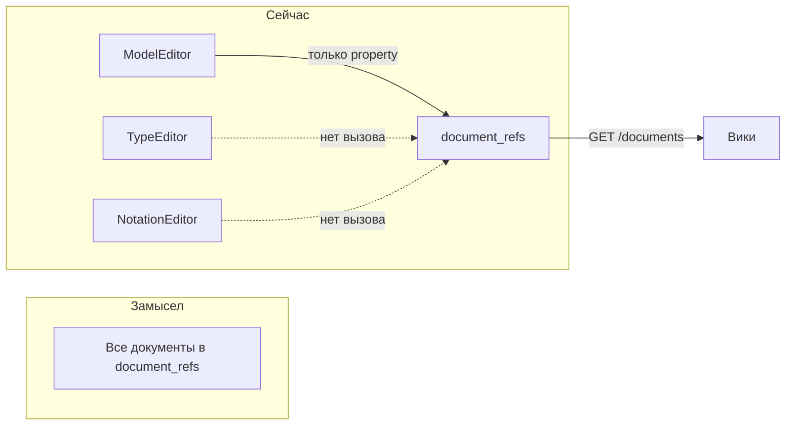

# Вики из пользовательской документации

**Ветка:** `wiki-user-docs` (warchi). Бэкенд: репозиторий arepos-server.

---

## Замысел: document_refs как единое место для всех документов

Таблица **document_refs** (arepos-server: `src/main/resources/db/changelog/018-add-document-refs.sql`) создана именно для того, чтобы в неё попадали **все** привязки документов к контексту. Таким образом, вики строится поверх этой таблицы — один источник правды.

## Канонический список: у кого есть документация

Документация предусмотрена у перечисленных сущностей; **у линка (модельной связи между нодами) документации нет**.

| Сущность                 | Контекст в document_refs       | Где хранится documentFileId                  | Примечание                                                                    |
| ------------------------ | ------------------------------ | -------------------------------------------- | ----------------------------------------------------------------------------- |
| **Форма** (node shape)   | `node_shape_id` (добавить)     | в attrs формы (добавить attrs у node_shapes) | Сейчас у NodeShapes нет attrs                                                 |
| **Тип узла**             | `node_type_id`                 | attrs типа (NodeTypes.attrs)                 | Есть                                                                          |
| **Тип связи**            | `link_type_id`                 | attrs типа (LinkTypes.attrs)                 | Есть                                                                          |
| **Нотация**              | `notation_id`                  | Notations.attrs                              | Есть                                                                          |
| **Компонент нотации**    | `notation_id` + `component_id` | Components.attrs                             | Есть                                                                          |
| **Отношение** (relation) | `relation_id` (добавить)       | Relations.attrs                              | В document_refs нет relation_id                                               |
| **Модель**               | `model_id`                     | Models.attrs                                 | Есть (getModelDocFileId/setModelDocFileId)                                    |
| **Диаграмма**            | `diagram_id` (добавить)        | Diagrams.attrs                               | В document_refs нет diagram_id                                                |
| **Нода**                 | `model_id` + `node_id`         | Nodes.attrs (ModelNodeAttrs)                 | Есть                                                                          |
| **Линк**                 | —                              | **нет**                                      | По решению: документации у линка не будет (ModelLinkAttrs без documentFileId) |

## Текущее состояние

- **Модель, нода, диаграмма**: в `src/features/models/ModelEditor.vue` есть UI и сохранение в attrs (`setModelDocFileId`, `node.parsedAttrs.documentFileId`, `diagram.parsedAttrs.documentFileId`), но вызов `POST /documents` в `handleDocSaved` выполняется **только** для ветки «property» (документ из componentProperties). Для model/node/diagram ref в document_refs **не регистрируется**. В таблице document_refs нет поля `diagram_id` — для диаграммы нельзя однозначно завести ref.
- **Нотации**: документация есть у самой нотации, у компонентов и у связей (relations). Вызов `POST /documents` при сохранении **ни для кого не выполняется**. В document_refs нет `relation_id` для связей.
- **Типы**: у типов нод/связей в attrs, при сохранении документа регистрация ref **не выполняется**.
- **Форма (shape)**: у сущности NodeShapes нет поля attrs (только name, outline, contentArea). В document_refs нет `node_shape_id`. UI документации в редакторе форм отсутствует.

Бэкенд уже умеет: `GET /api/v1/documents` без параметров возвращает все refs текущего пользователя (DocumentRefsRepository.findByFilters с опциональными UUID). Ответ сейчас — `DocumentItem(fileId, label)` без контекста (какой тип/нотация/модель/узел).

---

## План реализации

Порядок выполнения: **0** (схема и API на бэкенде) → **1** (регистрация ref во всех редакторах) → **2** (расширенный ответ для вики) → **3** (страница Вики на фронте). Шаги 1 и 2 можно частично совмещать после появления новых полей в API.

### 0. Бэкенд (arepos-server): схема под полный список сущностей

- **document_refs**: добавить колонки `diagram_id` (FK → diagrams), `relation_id` (FK → relations), `node_shape_id` (FK → node_shapes). Обновить constraint: хотя бы одно из полей контекста должно быть задано (включая новые).
- **node_shapes**: добавить колонку `attrs` (jsonb), чтобы хранить `documentFileId` (и при необходимости другое). Либо отдельная колонка `document_file_id` (uuid, FK → files).
- **DocumentRefs** (entity), **RegisterDocumentRefRequest**, **DocumentRefsService**, **DocumentRefsRepository** (findByFilters): поддержать параметры `diagramId`, `relationId`, `nodeShapeId`.

Файлы: миграция в `src/main/resources/db/changelog/`, сущность `model/DocumentRefs.kt`, `service/DocumentRefsService.kt`, `controller/DocumentsController.kt`, `repository/DocumentRefsRepository.kt`.

### 1. Фронт (warchi): довести регистрацию ref до всех мест, где сохраняется документ

- **Редактор модели** (`src/features/models/ModelEditor.vue`): в `handleDocSaved` после установки fileId в state вызывать `POST /documents`:
  - для `target.kind === 'model'`: `{ fileId, modelId }`;
  - для `target.kind === 'node'`: `{ fileId, modelId, nodeId }`;
  - для `target.kind === 'diagram'`: `{ fileId, modelId, diagramId }` (после появления diagram_id в API).
- **Редактор типов** (`src/features/types/TypeEditorPage.vue`): при сохранении документа вызывать `POST /documents` с `{ fileId, nodeTypeId }` или `{ fileId, linkTypeId }`.
- **Редактор нотаций** (`src/views/NotationEditorView.vue`): при сохранении документа вызывать `POST /documents`:
  - нотация: `{ fileId, notationId }`;
  - компонент: `{ fileId, notationId, componentId }`;
  - отношение: `{ fileId, notationId, relationId }` (после появления relation_id в API).
- **Редактор форм** (`src/features/shapes/ShapeEditorPage.vue`): после появления attrs/documentFileId у формы (шаг 0) — кнопка «Документация», модалка DocumentEditorModal, при сохранении вызов `POST /documents` с `{ fileId, nodeShapeId }`.

### 2. Бэкенд (arepos-server): расширить ответ GET /documents для вики

- При вызове `GET /documents` без параметров (или с параметром `wiki=true`) возвращать для каждой записи контекст, чтобы в вики показывать «Тип X», «Нотация Y / Компонент Z», «Модель M / Узел N» и т.д.
- Расширить DTO (например, `DocumentItem` или новый `DocumentWikiItem`): добавить поля `entityType`, `entityId`, `entityName`, при необходимости `parentName`. Реализация: при формировании списка подгружать связанные сущности (model, node, diagram, notation, component, relation, nodeType, linkType, nodeShape) и заполнять человекочитаемые названия для вики.

### 3. Фронт (warchi): страница «Вики»

- Новый маршрут (например, `/wiki`) и страница со списком документов: запрос `GET /documents` без параметров, отображение списка с контекстом (entityName, тип сущности).
- Клик по строке: загрузка контента `GET /files/{id}` и отображение markdown (переиспользовать рендер из `src/features/docs/components/DocsContent.vue` или превью из DocumentEditorModal).
- По желанию: поиск/фильтр по названию, группировка по типу контекста (модели, нотации, типы).

После этого вики будет полностью опираться на таблицу **document_refs**, в которую по замыслу попадают все документы.

---

## Что уточнить перед реализацией

1. **Форма (node_shapes)**: хранить documentFileId в общем jsonb `attrs` (как у остальных сущностей) или в отдельной колонке `document_file_id`?
2. **Размещение вики в приложении**: отдельный пункт в навбаре («Вики»), подраздел «Документация» (/docs/wiki) или иначе?
